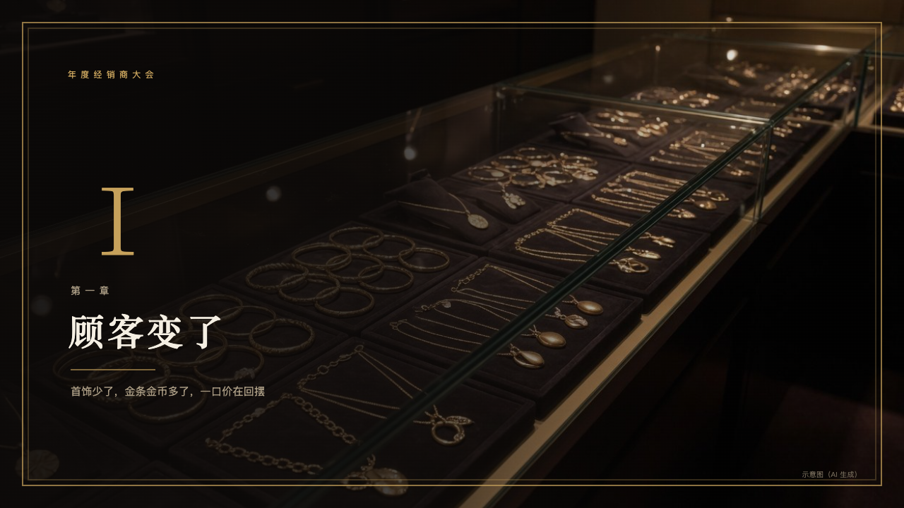
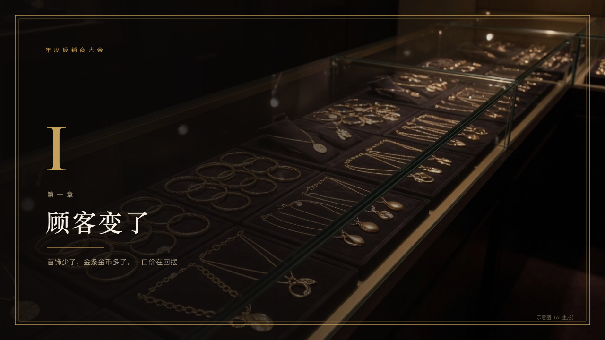

# invitation-chapter

A part of the evening opens under a veil of black inside a gilt frame.

Code: [`src/layouts/chapter-invitation-chapter.tsx`](../../../src/layouts/chapter-invitation-chapter.tsx). Used by luxe.

## luxe, gold dealer conference sample, 2026-10

Settled on p05. The round's decisions are in [2026-10-08-luxe](../../rounds/2026-10-08-luxe/README.md).

| board (p05) | engine |
| :-: | :-: |
|  |  |

**What it looks like.** The page's photograph runs the whole page under a veil of black from the left (94% to 15%), inside a double gilt frame 32px in. The occasion small and tracked in gold at the top left, the part's Roman numeral at 140px in the gold serif (counted among the chapter pages), the chapter (`kicker`) small in old gold, the title at 52px in the ivory serif, a short gold rule and the subtitle in old gold. The page's `footnote` stands small at the bottom right.

**Why.** Each part is a new card of the same invitation, opened on a picture of the world it is about.

**What it gave up.**

- The numerals are the Latin capitals I, II, III closed up rather than the single Roman numeral glyphs.
