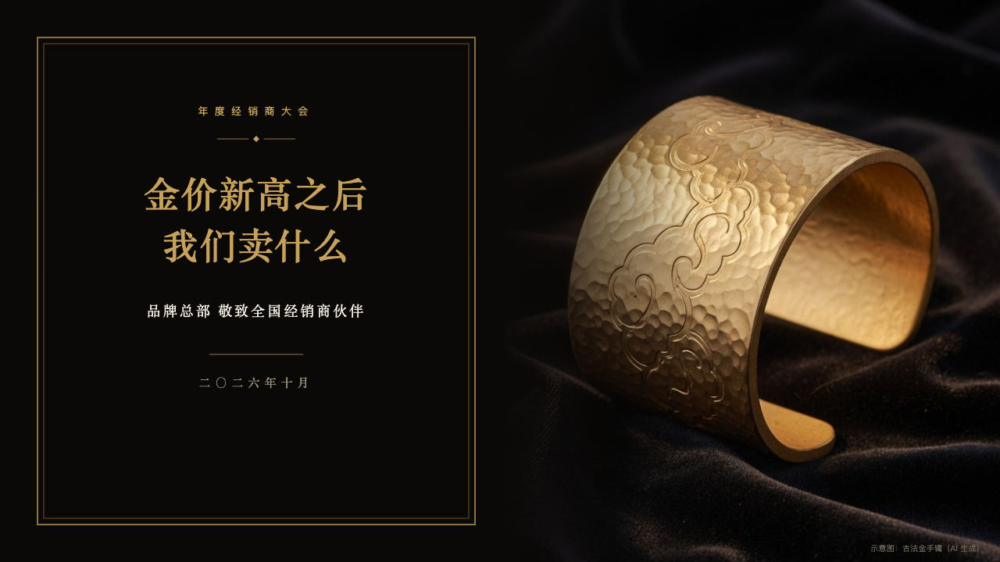
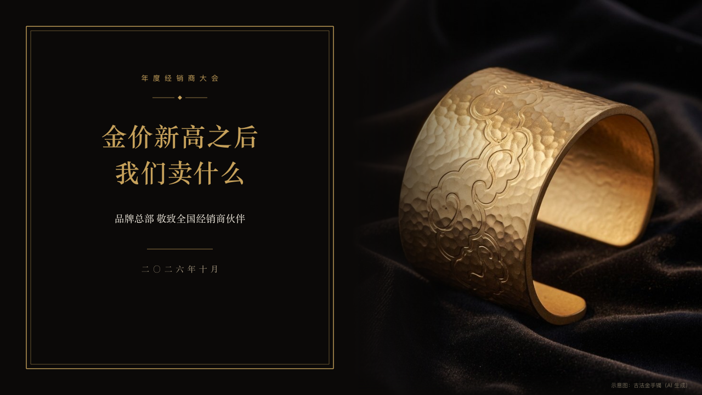

# invitation-cover

luxe's cover: the invitation card beside the page's photograph.

Code: [`src/layouts/cover-invitation-cover.tsx`](../../../src/layouts/cover-invitation-cover.tsx). Used by luxe.

## luxe, gold dealer conference sample, 2026-10

Settled on p01. The round's decisions are in [2026-10-08-luxe](../../rounds/2026-10-08-luxe/README.md).

| board (p01) | engine |
| :-: | :-: |
|  |  |

**What it looks like.** A double gilt frame at the left (x48, 560 by 624) holding the occasion tracked wide in gold (the page's `kicker`, or the deck's organization), a gold diamond between two short rules, the title at 46/66 in the gold serif as the author breaks it, the subtitle at 18px in the ivory serif, a short gold rule and the date (the footer's `label`). The page's photograph runs down the right half and fades into the stock at its left. The page's `footnote` stands small at the bottom right. Without a photograph the card stands in the middle.

**Why.** The first page is the invitation itself, handed over with the object the evening is about.

**What it gave up.**

- A title past three lines at 38px is declared dropped rather than cut.
