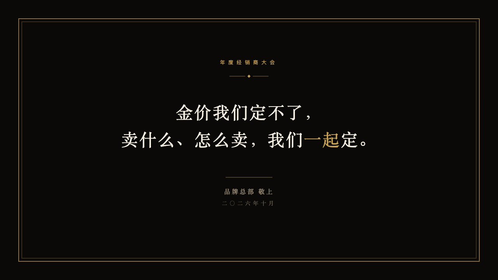
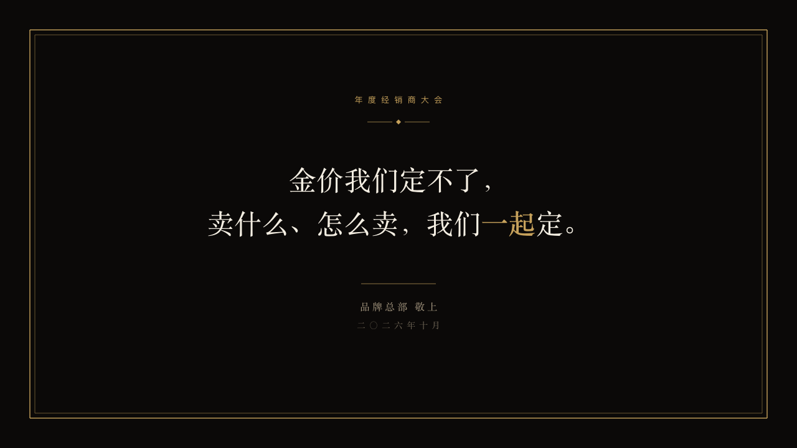

# invitation-ending

The invitation closes as it opened, signed by the house.

Code: [`src/layouts/ending-invitation-ending.tsx`](../../../src/layouts/ending-invitation-ending.tsx). Used by luxe.

## luxe, gold dealer conference sample, 2026-10

Settled on p18. The round's decisions are in [2026-10-08-luxe](../../rounds/2026-10-08-luxe/README.md).

| board (p18) | engine |
| :-: | :-: |
|  |  |

**What it looks like.** A double gilt frame 48px in. The occasion tracked wide in gold, a gold diamond, the closing words at 44/70 in the ivory serif with the words the author marks in gold, a short gold rule, the house's signature (`subheading`) in old gold and the date in the dim gold.

**Why.** The last page is signed, as an invitation is.

**What it gave up.**

- No photograph and no footnote: the board drew none.
