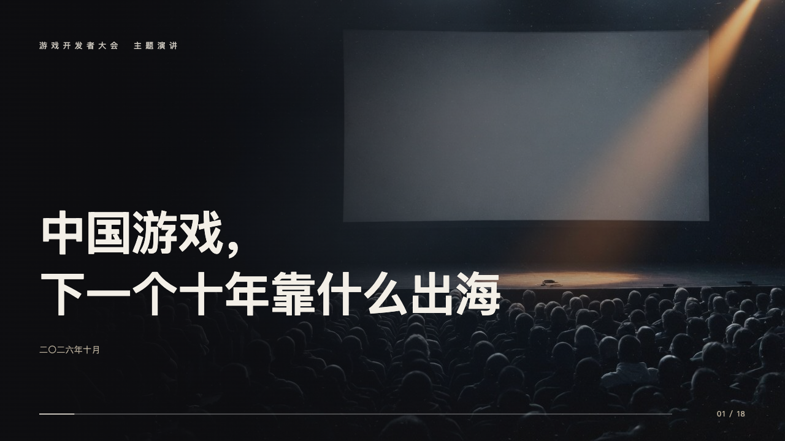
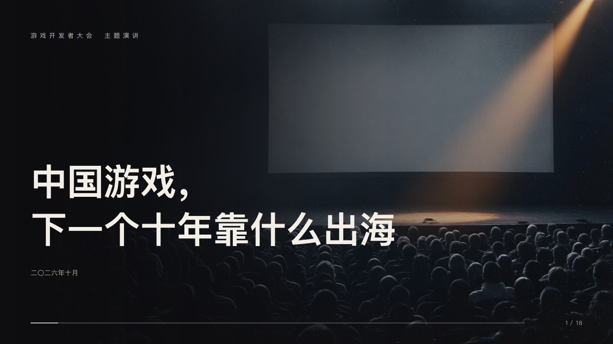

# keynote-cover

The hall from the back row: the page's photograph darkening from the left, the occasion small in silver, the title large and bold, the date and the clicker.

Code: [`src/layouts/cover-keynote-cover.tsx`](../../../src/layouts/cover-keynote-cover.tsx). Used by stage.

## stage, game developers keynote sample, 2026-10

Settled on p01. The round's decisions are in [2026-10-08-stage](../../rounds/2026-10-08-stage/README.md).

| board (p01) | engine |
| :-: | :-: |
|  |  |

**What it looks like.** The page's photograph (its first `image` or its `background` asset) across the page under a wash of the black from the left, 92% to 55% at the middle to 10%. The `kicker` at 13px in silver tracked 6px from y64. The title bold at 76/100 in a 900px column, broken at a comma or where the author broke it, its last line ending on y530. The date (`meta.date`) at 14px in the sand from y560, a subheading above it at 17px when the page has one. The clicker along the foot, its track the paper white a quarter strong.

**Why.** The house lights go down on a full room and the question of the talk is the only thing lit.

**What it gave up.**

- A `footnote` stands as a caption at the bottom right over the clicker. The sample's photographs say they are AI-generated in their speaker notes, as the board left the cover and chapters without a caption.
