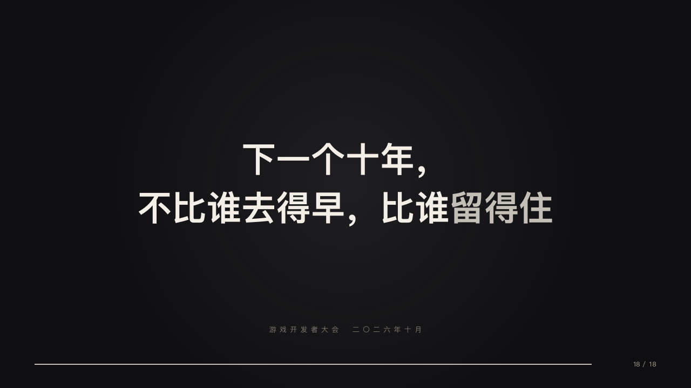

# keynote-ending

The last sentence alone on the black in a faint follow spot, its marked words in silver, the occasion small at the foot and the clicker run to its end.

Code: [`src/layouts/ending-keynote-ending.tsx`](../../../src/layouts/ending-keynote-ending.tsx). Used by stage.

## stage, game developers keynote sample, 2026-10

Settled on p18. The round's decisions are in [2026-10-08-stage](../../rounds/2026-10-08-stage/README.md).

| board (p18) | engine |
| :-: | :-: |
|  |  |

**What it looks like.** A follow spot 460px in radius at (640, 340). The heading bold at 64/90 centred, on the author's two lines from y250 or on one line where the middle of two would be, its `**…**` words in silver. The `subheading` at 13px in the dim tracked 6px centred from y600. The clicker along the foot, full.

**Why.** A keynote ends on one line the room repeats on the way out.

**What it gave up.**

- The marked words are the accent, as the board drew them. The shared faces keep stage's warm sand `emphasisInk` for `**…**` in small type, where the silver reads faded on the paper white.
