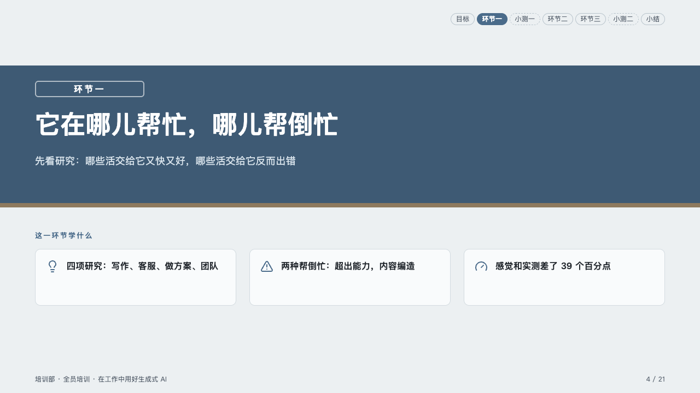
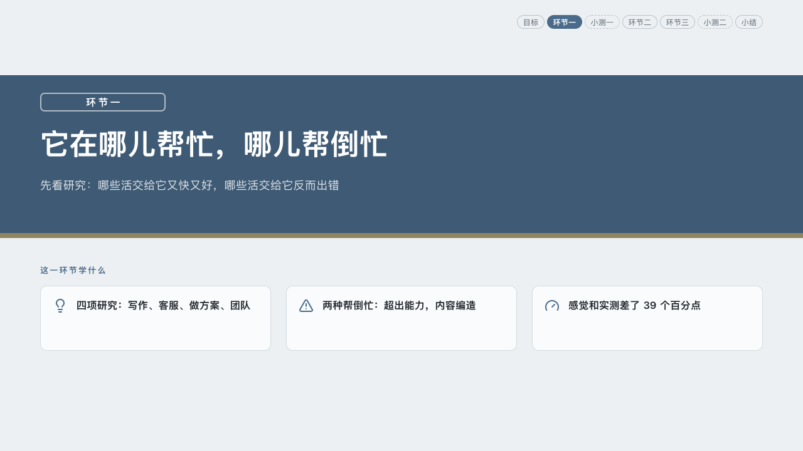
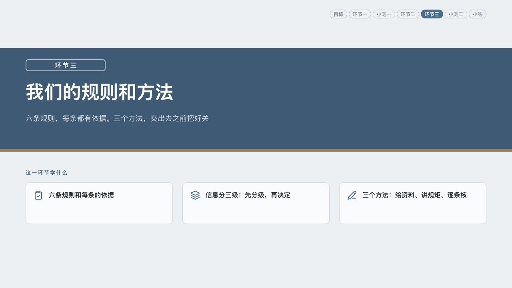

# lesson-chapter

homeroom's part of a lesson: a band of board across the page.

Code: [`src/layouts/chapter-lesson-chapter.tsx`](../../../src/layouts/chapter-lesson-chapter.tsx).

## homeroom, AI-at-work training sample, 2026-10

Settled on the three part pages (p04, p11, p14). The round's decisions are in [rounds/2026-10-06-homeroom](../../rounds/2026-10-06-homeroom/README.md).

| board (p04) | engine |
| :-: | :-: |
|  |  |

| board (p11) | engine |
| :-: | :-: |
|  |  |

| board (p14) | engine |
| :-: | :-: |
|  |  |

**What it looks like.** A band of board across the page from y120 to y372 over an 8px ledge of wood. On it the part's name in a box outlined in white at 60%, bold 16px white, its characters 3px apart (the page's `kicker`, the author's own words: 「环节一」, "Part 1"); the title in white at 46/64 on one line; what it answers at 18/30 in pale chalk, up to two lines. Under the band 「这一环节学什么」 ("In this part") at 13px bold in the mark, and three cards, each an item of the page's `row_cards`: its icon in the mark and its words bold at 16/26. The course strip at the top right lights the part. A background photograph is laid inside the band only, under the board's ink at 82%.

**Why.** Each part of a class starts with where the class has got to and what the part will teach.

**What it gave up.**

- No footer: the shared footer row goes on content pages only, the deck-wide rule (`ir/footer.ts`). The board printed the folio on every page.
- The engine no longer prints a fixed "LESSON n": the box holds the author's `kicker`.
