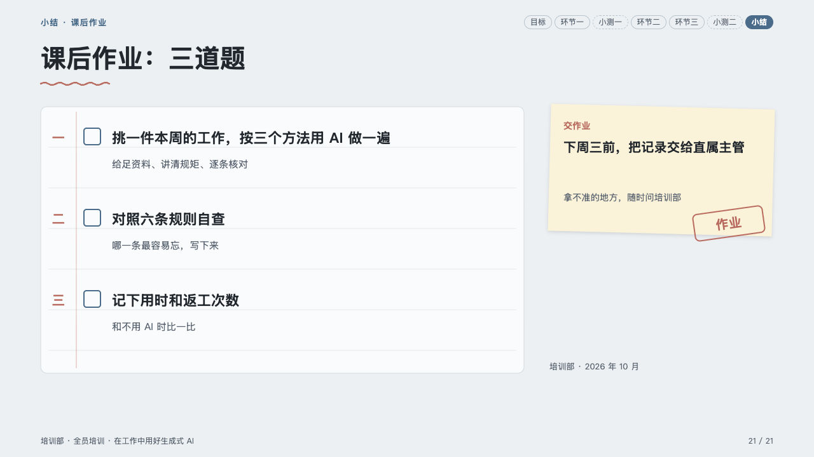
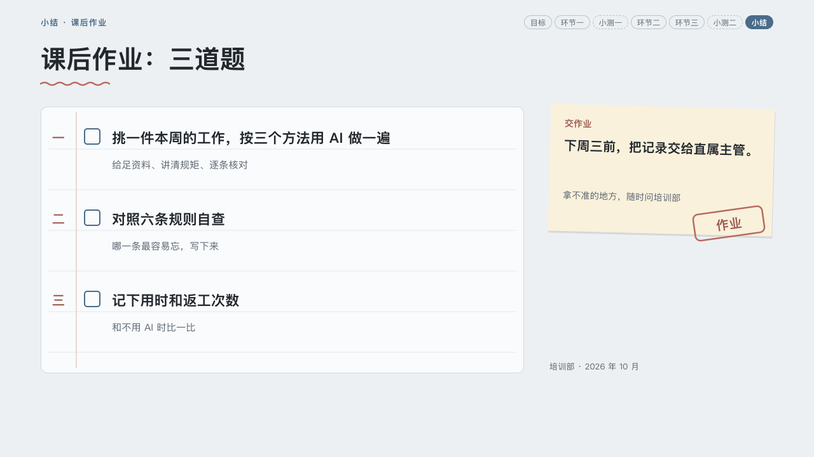

# lesson-ending

homeroom's close: the homework.

Code: [`src/layouts/ending-lesson-ending.tsx`](../../../src/layouts/ending-lesson-ending.tsx).

## homeroom, AI-at-work training sample, 2026-10

Settled on p21. The round's decisions are in [rounds/2026-10-06-homeroom](../../rounds/2026-10-06-homeroom/README.md).

| board (p21) | engine |
| :-: | :-: |
|  |  |

**What it looks like.** The step's label and the course strip as on a content page; the title bold at 40/56 over the pen's wavy line; the subheading, when there is one, a muted line under it. At the left a sheet of ruled paper, 760 by 420, with a red margin, ruled every half a task's height (64px for three tasks) from just under the first task's title, 4px clear of its descenders: each item of the page's `numbered_cards` a task, its numeral in the pen (「一」 in a Chinese deck), an empty box, its title bold at 22px and its hint muted at 15px; two to five tasks, closer together when there are more. At the right a sticky note turned 1.5 degrees: the callout's title in the pen, the text's first sentence bold at 20/32 and the rest muted, with the page's `stamp` (「作业」) pressed on its corner. Under the note the office and the date.

**Why.** A class ends on what to do before the next one, written where the room would copy it.

**What it gave up.**

- No footer, the deck-wide rule.
- The rules sit three pixels lower than the board's, so the English titles' descenders clear them by the brief's 4px.
- The title is always drawn: the tasks come from `numbered_cards` only, never from the heading.
- A stamp's date line is not drawn and is declared.
