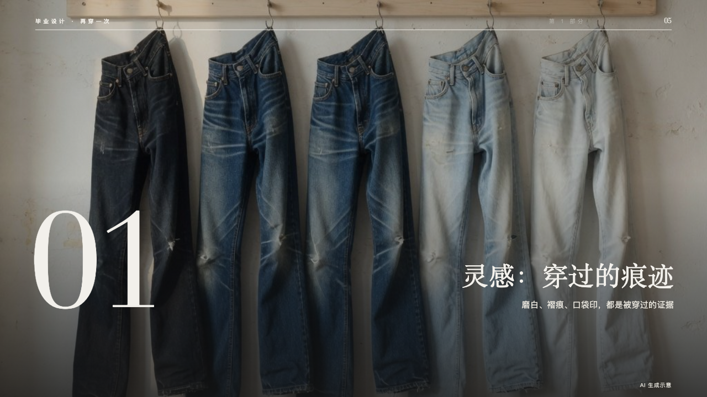
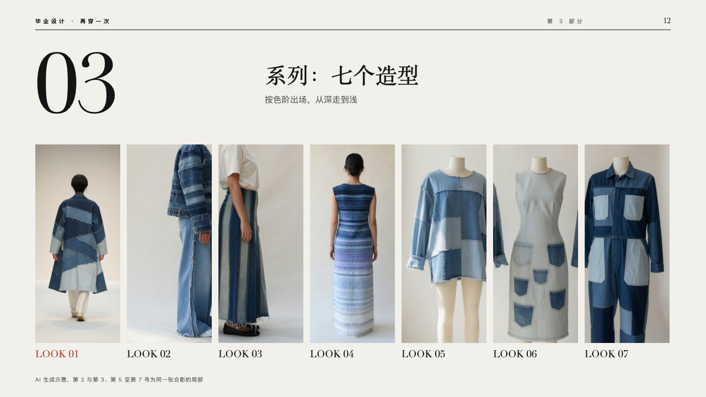
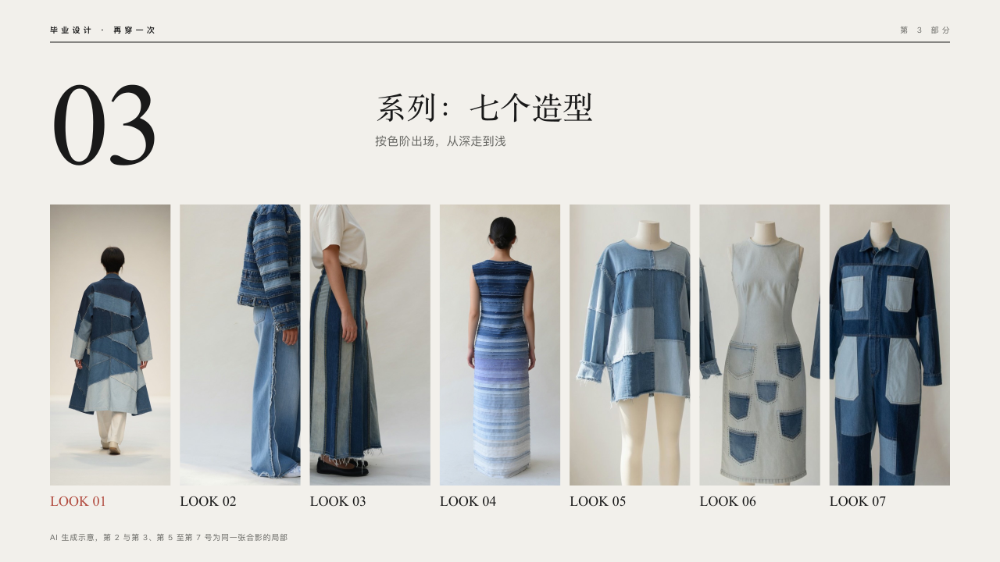

# lineup-chapter

runway's chapter page: a part opens on a photograph, or on its looks in a row.

Code: [`src/layouts/chapter-lineup-chapter.tsx`](../../../src/layouts/chapter-lineup-chapter.tsx), with the row drawn by the composition [`parade`](../../compositions/parade/README.md). Used by runway.

## runway, graduation collection review sample, 2026-10

Settled on p05 and p07 (a photograph) and p12 (the looks in a row). The round's decisions are in [2026-10-08-runway](../../rounds/2026-10-08-runway/README.md).

| board (p05) | engine |
| :-: | :-: |
|  |  |

| board (p12) | engine |
| :-: | :-: |
|  |  |

**What it looks like.** Over a photograph (the page's first `image`, with its `crop`, or its `background`): the photograph across the whole page darkening toward the floor, a darker band behind the masthead, the masthead in the paper with the part named (the page's `kicker`, or 「第 N 部分」, "Part N"), the part's number at 240px in the serif at the bottom left, its title at 48px in the serif and its line at 15px right-aligned at the bottom right, and the page's `footnote` small at the bottom right. Over the looks in a row (an `image_grid`): the paper, the masthead in the ink, the part's number at 150px at the top left, the title at 40px and its line beside it, the row of windows from y262 drawn by `parade`, and the `footnote` small at the bottom left. Without either, the stage.

**Why.** Each part of a show opens on a picture of the work, and the part that brings the looks out opens on the looks themselves.

**What it gave up.**

- No page number: the engine prints it on content pages only. The board printed 「05」.
- A title that does not fit one line at its smallest size, or a line past one line, is declared dropped rather than cut.
