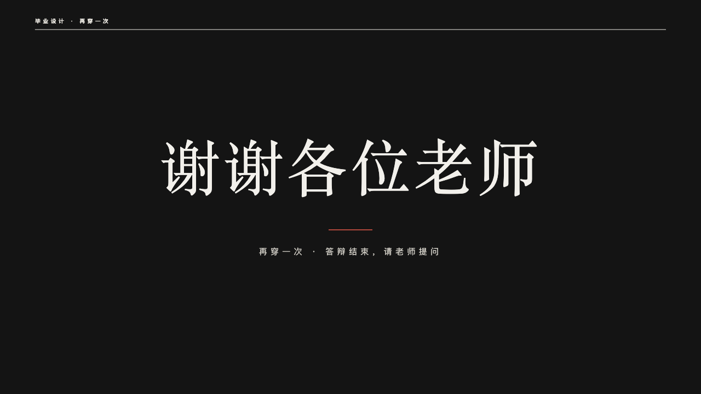
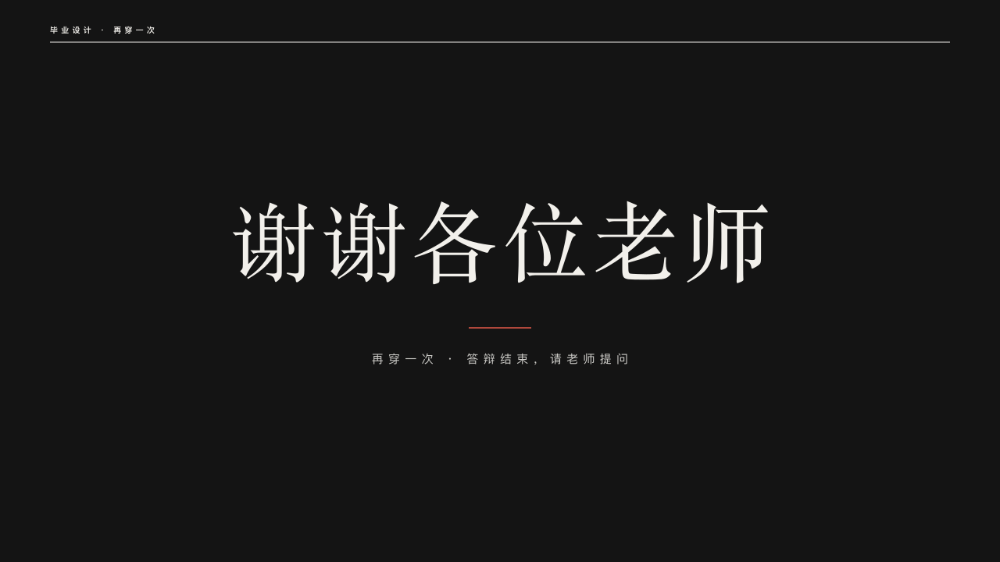

# lineup-ending

runway's close: the bow on a black stage.

Code: [`src/layouts/ending-lineup-ending.tsx`](../../../src/layouts/ending-lineup-ending.tsx). Used by runway.

## runway, graduation collection review sample, 2026-10

Settled on p18. The round's decisions are in [2026-10-08-runway](../../rounds/2026-10-08-runway/README.md).

| board (p18) | engine |
| :-: | :-: |
|  |  |

**What it looks like.** The stage (the theme's primary) across the page, the masthead in the paper with the show's label alone, the closing words at 110px in the serif centred and tracked 6px (down to 64px to stay on one line), a short crimson rule 80px wide on y420, and the subheading at 15px tracked 6px in the paper's quieter tone under it.

**Why.** The last page is the designer stepping out to take the bow before the questions.

**What it gave up.**

- Closing words that do not fit one line at 64px are declared dropped rather than cut.
