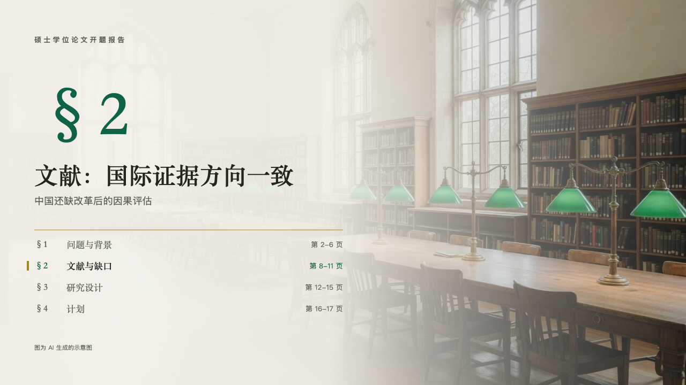

# manuscript-chapter

thesis's section page: the section's number over the photograph, with the whole deck's contents.

Code: [`src/layouts/chapter-manuscript-chapter.tsx`](../../../src/layouts/chapter-manuscript-chapter.tsx).

## thesis, retirement age thesis proposal sample, 2026-10

Settled on p07. The round's decisions are in [rounds/2026-10-06-thesis](../../rounds/2026-10-06-thesis/README.md).

| board (p07) | engine |
| :-: | :-: |
|  |  |

**What it looks like.** The page's photograph full bleed under ivory from the left (97% at the left edge, 93% at 48%, 35% at 78%, 5% at the right edge). The deck's label at the top left at 13px bold in the grey, its characters 4px apart. The section's number at 120px bold in emerald in the heading serif (「§ 2」): the page's `stage` numbered by its place in the deck's `course`, or the chapter pages counted so far when the deck has no course. The title at 44/60 bold in the heading serif, the subheading at 18/30 in the grey. Under a gold hairline the deck's contents, a section a row: its number and name at 17px in the heading serif and, at the right, the content pages it runs over at 13px (「第 8-11 页」, "pp. 8-11"). The page's own section is lit, in emerald with its name bold and a 4px gold bar at its left, the others in the grey. At the foot the page's `footnote`.

**Why.** A long defense loses the room between sections. The contents with this section lit say where the talk stands and how much is left.

**What it gave up.**

- A title on two lines moves everything under it down a line, and the contents keep the rows that still fit above y630. The rest are declared dropped.
- The section's number is the Latin face's 「§」 with a thin space, where the board set Songti's full-em mark.
- No motif and no folio.
