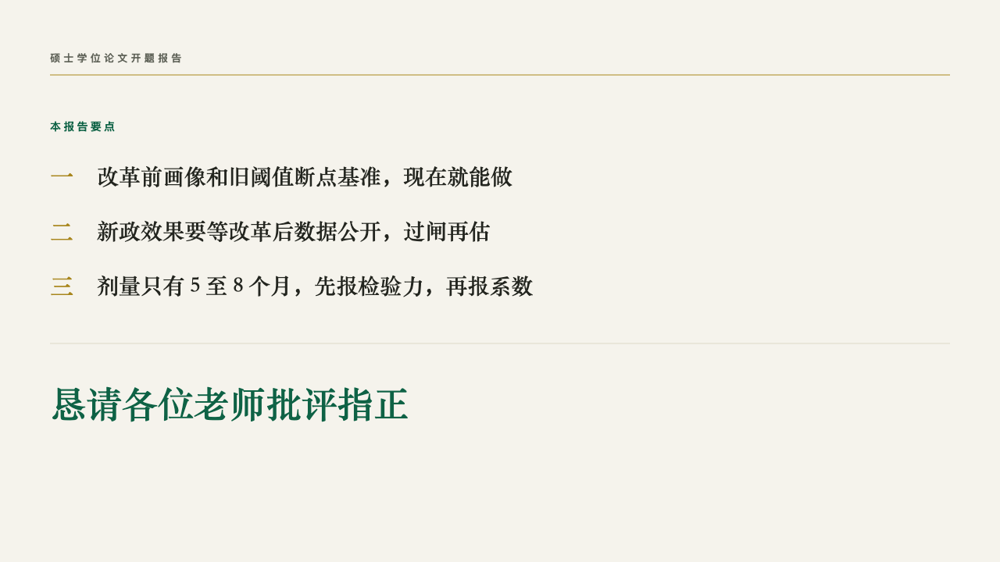
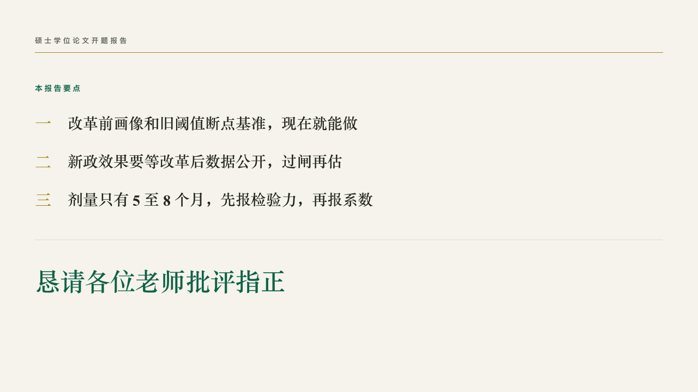

# manuscript-ending

thesis's close: the points the talk leaves, and the closing line.

Code: [`src/layouts/ending-manuscript-ending.tsx`](../../../src/layouts/ending-manuscript-ending.tsx).

## thesis, retirement age thesis proposal sample, 2026-10

Settled on p18. The round's decisions are in [rounds/2026-10-06-thesis](../../rounds/2026-10-06-thesis/README.md).

| board (p18) | engine |
| :-: | :-: |
|  |  |

**What it looks like.** The deck's label at the top left over a gold hairline across the type area on y96. The author's own small title (the page's `kicker`, 「本报告要点」) at 14px bold in emerald, its characters 3px apart. The page's `bullets`, three at most, a point a line: its numeral at 30px bold in gold in the heading serif (「一」「二」「三」 in a Chinese deck, 1 2 3 otherwise) and the point at 28/50 bold in the heading serif in the ink. A hairline on y440, then the closing line (the page's heading, 「恳请各位老师批评指正」) at 46/70 bold in emerald.

**Why.** A defense ends on what it established and a request for the committee's comments. The small title is the author's, because a proposal's close is not always a conclusion.

**What it gave up.**

- A point past one line is declared dropped, and validate refuses a fourth point.
- No fixed word in the small title: the author writes it or the page has none.
- No motif and no folio.
