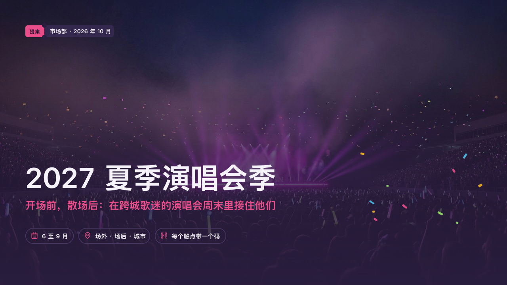

# marquee-cover

rally's cover: the campaign's photograph darkening toward the foot, the title standing huge in the dark.

Code: [`src/layouts/cover-marquee-cover.tsx`](../../../src/layouts/cover-marquee-cover.tsx).

## rally, summer concert season proposal sample, 2026-10

Settled on p01. The round's decisions are in [rounds/2026-10-06-rally](../../rounds/2026-10-06-rally/README.md).

| board (p01) | engine |
| :-: | :-: |
|  |  |

**What it looks like.** The page's own `background` photograph fills the page under a darkening of the house colour from the foot up (97% at the foot, 75% at 40% of the height, 10% at 72%). At the top left, on y64, the ticket stub: the page's `kicker` on the magenta stamp (「提案」, "Proposal"), the office and the date on the stub (`meta.organization` and `meta.date`, 「市场部 · 2026 年 10 月」). The title bold at 72/86, on one line whenever it fits and broken at a comma when it does not, its last line on y475. Under it the subheading at 26px bold in the magenta, on one line. At y576 the page's `row_cards` as outlined pills 40px tall, each a magenta icon and a name at 15px bold (or a plain `bullets`, without icons). Twelve strips of confetti land at the lower right, from (900, 380) in a box 340 by 200, none on a word. Without a photograph the same words stand on the house colour.

**Why.** A campaign opens on the night it is for. The stub says what the deck is and who brings it, the pills give the campaign's three facts before the first page turns.

**What it gave up.**

- No motif and no folio: the proposal has not started.
- Pills with only a title and an icon: a `row_cards` item with text, a sub, a highlight or a tone is declared dropped rather than set as a pill, and so are pills wider than the page.
