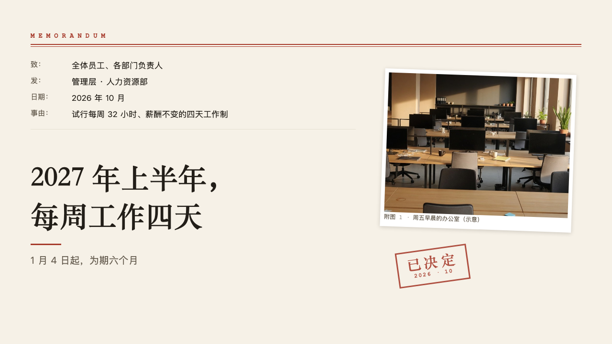
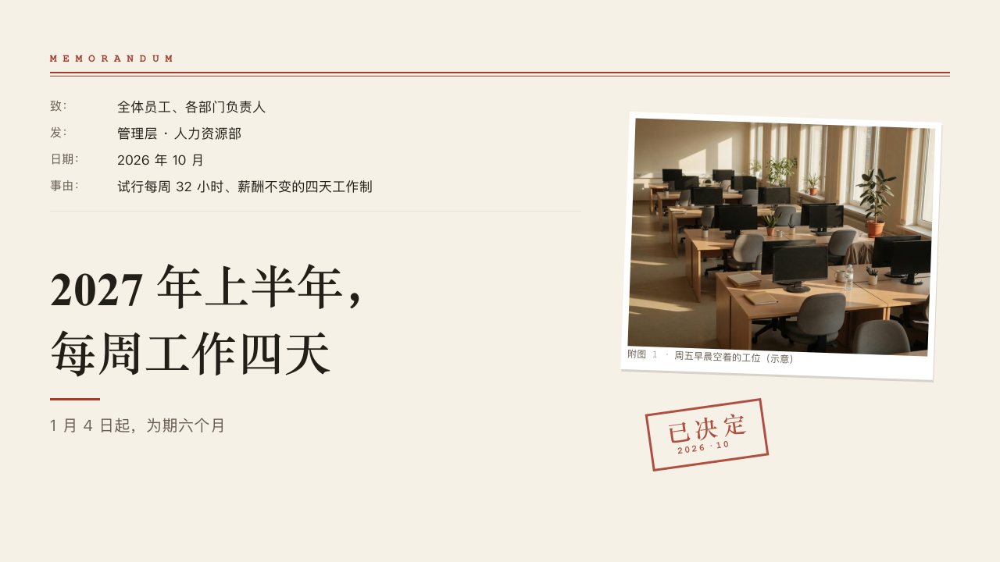

# memo-cover

memo's cover: MEMORANDUM over a red double rule, the header lines, the title in a serif over a short red bar, a photograph pasted in as exhibit 1, and a stamp.

Code: [`src/layouts/cover-memo-cover.tsx`](../../../src/layouts/cover-memo-cover.tsx), with the exhibit in [`compositions/exhibit.tsx`](../../../src/layouts/compositions/exhibit.tsx) and the stamp in [`compositions/stamp.tsx`](../../../src/layouts/compositions/stamp.tsx). Used by memo.

## memo, four-day week decision sample, 2026-10

Settled on p01. The round's decisions are in [rounds/2026-10-05-memo](../../rounds/2026-10-05-memo/README.md).

| board (p01) | engine |
| :-: | :-: |
|  |  |

**What it looks like.** MEMORANDUM at 14px bold mono in the mark, 8px apart, at the top left, over a 2px rule at y92 and a 1px rule at y97 from x64 to x1216. The page's `fields`, up to four, one a line from y124 every 34px: the label and a colon in 15px muted mono (「致：」「发：」「日期：」「事由：」), the value in the body face at 17px from x150, a note after the value when it has one. A hairline under the last line. The title bold in the heading face at 60/80 in a 720px column, on its last line at y490, on one line when it fits and broken at a comma when it does not. A 64 by 3 bar of the mark at y510, the subtitle at 20/30 in the muted ink under it. The page's `image` pasted in as exhibit 1 at x800, y150, 400 by 330, turned 2 degrees, and the page's `stamp` under it at x830, y520, turned -8 degrees. No motif: the cover sets its own head.

**Why.** A memo opens by saying who it is to, who it is from, when and what about, and a decided matter is stamped.

**What it gave up.**

- With no photograph the right of the page stays empty, and with no header lines the title area starts under the rule.
- A stamp too wide for its place is not drawn and is reported as dropped. A caption too long for its print is cut and reported.
