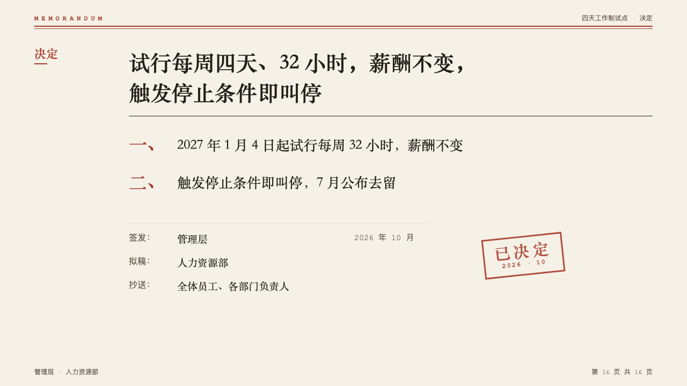
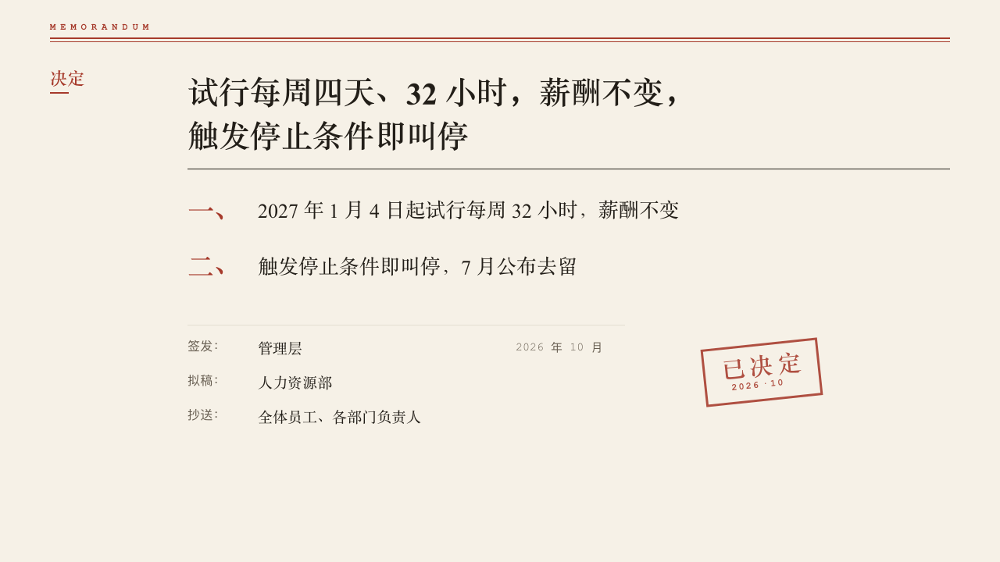

# memo-ending

memo's sign-off: the section's label in the margin, the decision in a serif over a rule of ink, its clauses numbered in red, the sign-off lines and a stamp.

Code: [`src/layouts/ending-memo-ending.tsx`](../../../src/layouts/ending-memo-ending.tsx). Used by memo.

## memo, four-day week decision sample, 2026-10

Settled on p16. The round's decisions are in [rounds/2026-10-05-memo](../../rounds/2026-10-05-memo/README.md).

| board (p16) | engine |
| :-: | :-: |
|  |  |

**What it looks like.** The page's `kicker` in the margin as on a content page. The decision bold in the heading face at 40/56 from x240, its last line at y200, broken at a comma when it does not fit one line, over a 1px rule of ink at y216. Up to three items of the first `bullets`, each after a red 34px numeral in the deck's numerals (「一、」, "1."), the item at 26/40 in the heading face, 70px apart. Then the page's `fields` as sign-off lines under a hairline: the label and a colon in 16px muted mono, the value at 19px in the heading face from x330, its note in 15px muted mono from x660. The page's `stamp` beside them at x900, turned -6 degrees.

**Why.** A decision memo closes on the decision, numbered so it can be quoted, and on who signed it.

**What it gave up.**

- No folio and no subject in the running head: footer marks are for content pages.
- More than three items are not drawn. Write the decision in three clauses or fewer.
