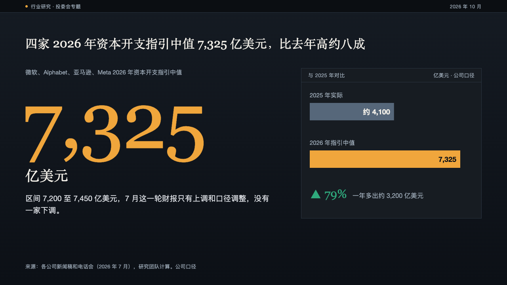
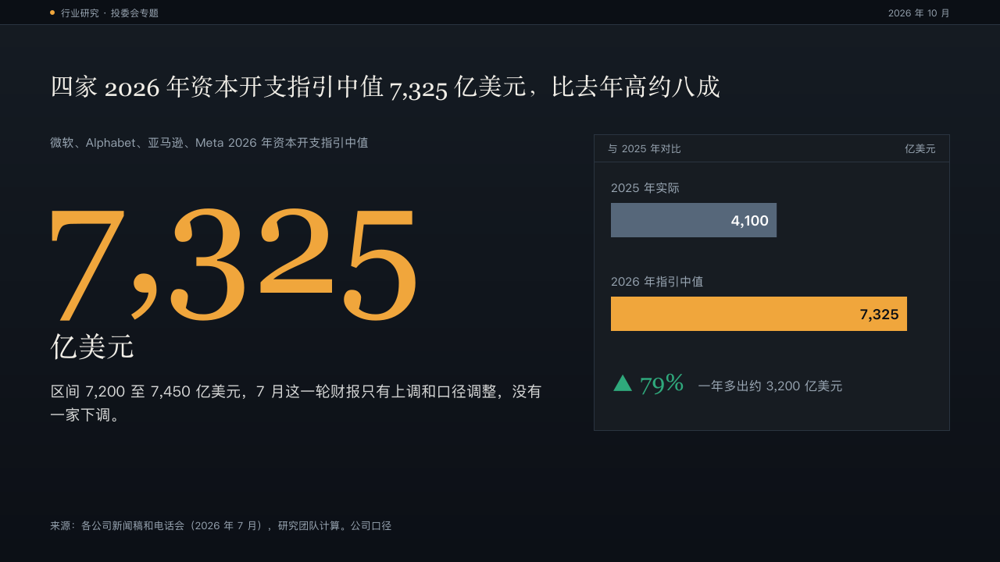

# panel-figure

ledger's single-figure page: the claim as on every content page, the one figure the page is about at 200px on the left, and what it is read against in a panel on the right.

Code: [`src/layouts/content-panel-figure.tsx`](../../../src/layouts/content-panel-figure.tsx), with the comparison bars in [`src/layouts/compositions/bars-panel.tsx`](../../../src/layouts/compositions/bars-panel.tsx) (`compareBarsPanel`). Used by ledger.

## ledger, AI capex sample, 2026-10

The round's decisions are in [rounds/2026-10-04-ledger](../../rounds/2026-10-04-ledger/README.md).

| board (p03) | engine |
| :-: | :-: |
|  |  |

**What it looks like.** The page is a `kpi_cards` and, optionally, a horizontal bar chart of one series. The first item is the lead: its label at 15px muted, the figure in the heading face at 200px in the mark (ledger's amber) from x58 (6px into the margin, where the face's figures carry their side bearing), its unit at 36px under it, and its note at 19/30 in up to two lines of 620px. On the right, a 456 by 380 panel from x760 holds two or three bars, each under its name at 15px with its value inside the bar's end, the bar the author marked (`data[].emphasis`) in amber. A second `kpi_cards` item is the move from the first bar to the last: its figure at 30px after an arrow in the direction's colour, its label beside it at 16px. With no chart, the other items stand in the panel as figure panels instead.

**Why.** A committee reads one number first. The figure carries the page alone, and the panel answers the first question about it: compared with what.

**What it gave up.**

- A figure too wide for its 680px column steps down to 160, 128 or 96px rather than running under the panel.
- A subheading has no place between the claim and the figure. A page with one, or a page of any other shape, is drawn as a panel sheet, and steps aside when that cannot hold it.
- A bar's value is a number, so an approximation ("约 4,100") is stated in the note, not in the bar.
