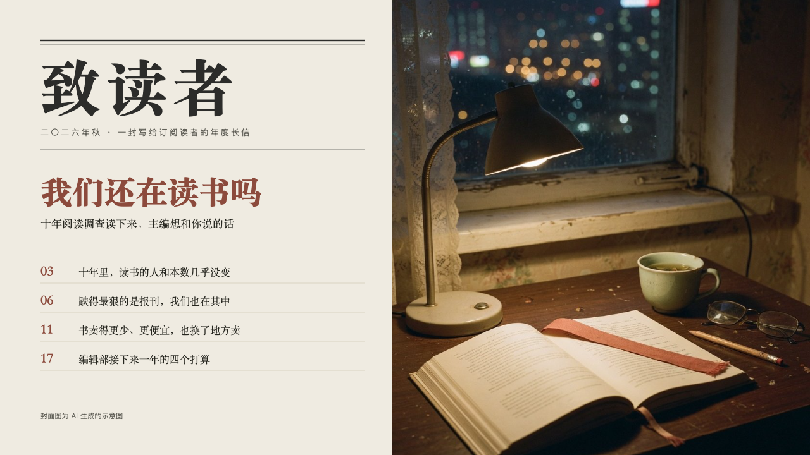

# periodical-cover

journal's cover: a small magazine's cover beside a photograph.

Code: [`src/layouts/cover-periodical-cover.tsx`](../../../src/layouts/cover-periodical-cover.tsx).

## journal, annual letter to readers sample, 2026-10

Settled on p01. The round's decisions are in [2026-10-07-journal](../../rounds/2026-10-07-journal/README.md).

| board (p01) | engine |
| :-: | :-: |
|  |  |

**What it looks like.** At the left, a heavy rule and a hairline (y64 and y70, to x576), then the masthead: the deck's `meta.organization` (「致读者」) at 96px in the heading serif, extra bold, 8px apart, smaller until it fits the column. Under it the issue in 13px grey (the page's `kicker`, 「二〇二六年秋 · 一封写给订阅读者的年度长信」) and a hairline on y236. The cover story is the page's heading at 50px in brick red, extra bold, smaller first and then broken at a comma or a colon. A 17px serif line under it is the page's `subheading`. Then the cover lines, the page's `fields`, four at most: the page each points to at 22px in brick red (the field's name, written by the author, 「03」) and the line at 16px in the heading serif, a hairline under each. The page's `footnote` at the foot (「封面图为 AI 生成的示意图」). At the right, 660px wide and full height, the page's own `background` photograph.

**Why.** A reader picks up an issue by its cover: whose letter it is, which issue, the story, and where to turn.

**What it gave up.**

- No components: the cover lines carry the contents. A fifth line is declared dropped.
- A masthead that will not fit at 28px is declared dropped.
- No motif and no folio.
