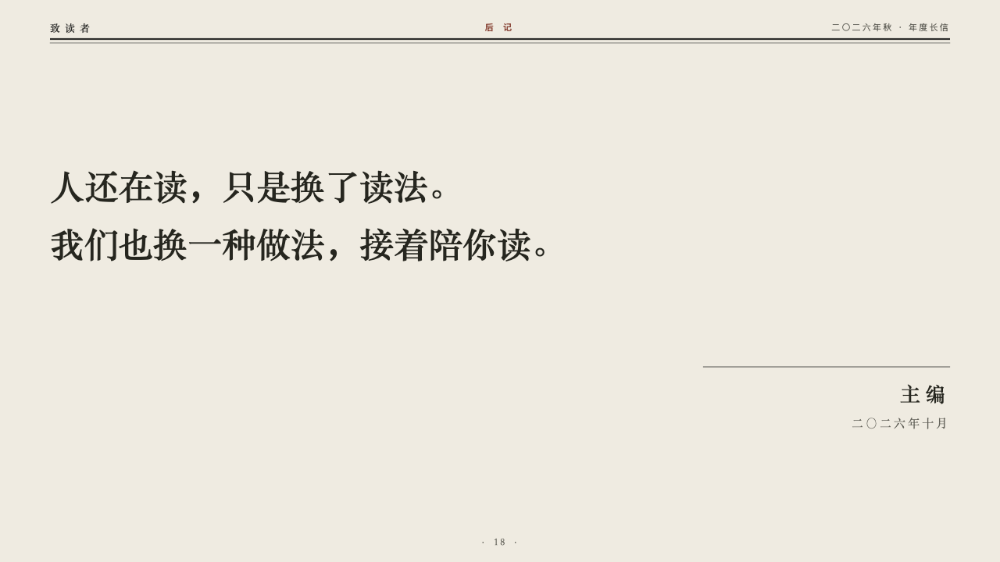
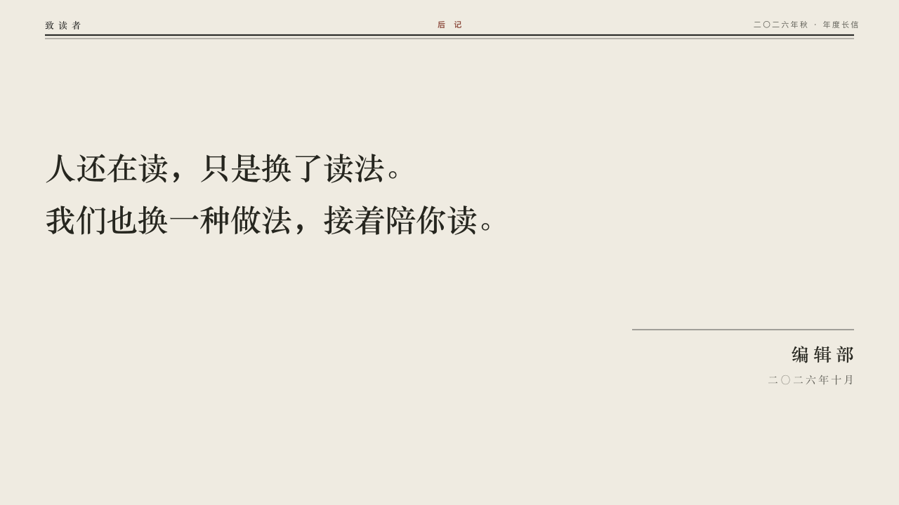

# periodical-ending

journal's close: an afterword signed by the editors.

Code: [`src/layouts/ending-periodical-ending.tsx`](../../../src/layouts/ending-periodical-ending.tsx).

## journal, annual letter to readers sample, 2026-10

Settled on p18. The round's decisions are in [2026-10-07-journal](../../rounds/2026-10-07-journal/README.md).

| board (p18) | engine |
| :-: | :-: |
|  |  |

**What it looks like.** The masthead as on a content page, its section the page's own `kicker` (「后记」, "Afterword"), written by the author. From y200 the closing words, the page's heading, at 44/74 bold in the heading serif, broken where the author broke them, two lines at most. At the right a hairline on y470 from x900 and under it, right-aligned, the page's `subheading` as the sign-off: its first line at 26px bold and tracked (「编辑部」, "The Editors"), its second at 15px in the grey (「二〇二六年十月」).

**Why.** A letter ends in its writers' voice and is signed, not summarised.

**What it gave up.**

- Nothing is hard-coded: the section, the closing words and the sign-off are the author's. The face that came before printed 「AFTERWORD」 and 「NEXT ISSUE」 itself.
- A third sign-off line is declared dropped, and a sign-off wider than the measure is declared dropped whole.
- No folio: the engine prints the page number on content pages only.
