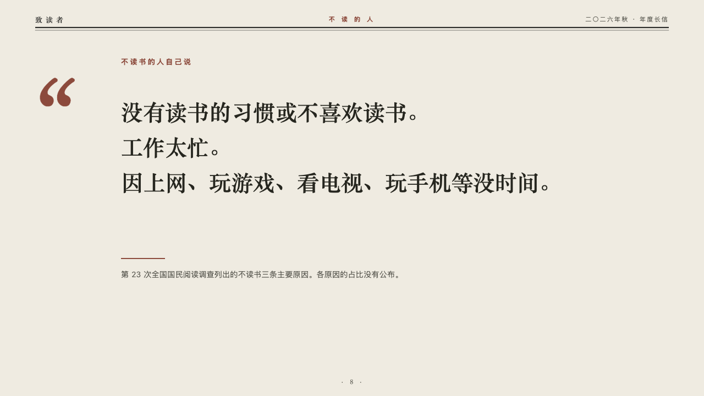
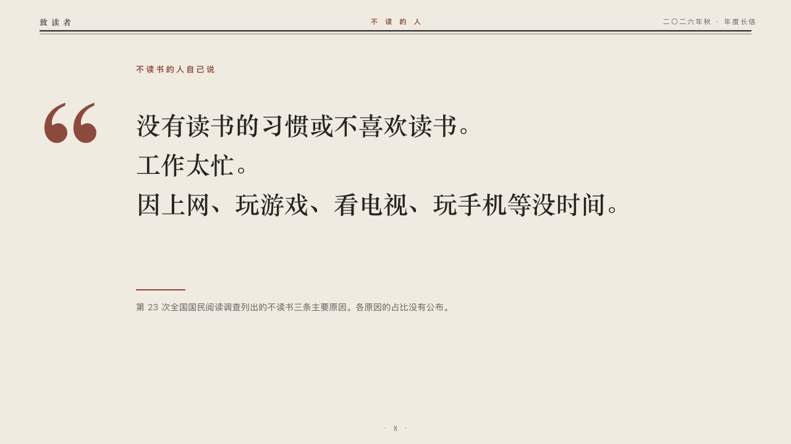

# periodical-quote

journal's quotation page.

Code: [`src/layouts/content-periodical-quote.tsx`](../../../src/layouts/content-periodical-quote.tsx).

## journal, annual letter to readers sample, 2026-10

Settled on p08. The round's decisions are in [2026-10-07-journal](../../rounds/2026-10-07-journal/README.md).

| board (p08) | engine |
| :-: | :-: |
|  |  |

**What it looks like.** The masthead as on every content page. The page's heading is a small line in brick red, 13px bold and tracked, saying whose words these are. A quotation mark at 200px in brick red stands at the left. The words are set at 40/64 in the heading serif, bold, one sentence a line where the author broke them, four lines at most. A short brick red rule on y470, and under it the attribution in the grey exactly as the author wrote it, nothing added before it. The page's source, when it has one, stands at the foot.

**Why.** A reason people give for not reading is read in their words before anything is said about it.

**What it gave up.**

- Takes one `blockquote`. A page it cannot set as a quotation (more than four lines, an attribution past two) gets the claim over the page and its body under it, and steps aside when that band cannot hold it.
- No dash is put before the attribution. The shared `pull-quote` face still adds one for themes that name it.
