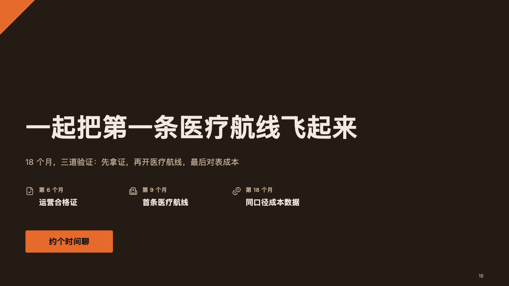
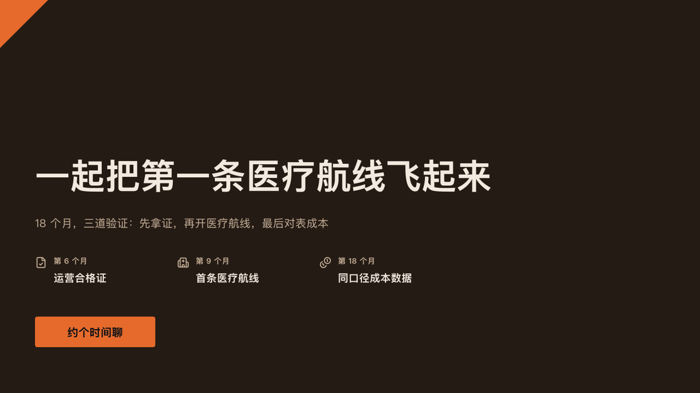

# pitch-ending

ember's close: the wedge, the closing line large, the steps the round pays for, and one button of the fire.

Code: [`src/layouts/ending-pitch-ending.tsx`](../../../src/layouts/ending-pitch-ending.tsx).

## ember, low-altitude delivery pitch sample, 2026-10

Settled on p16. The round's decisions are in [rounds/2026-10-06-ember](../../rounds/2026-10-06-ember/README.md).

| board (p16) | engine |
| :-: | :-: |
|  |  |

**What it looks like.** The stage, an 88px wedge of the fire at the top left. The title bold at 64/80 in the ivory, its last line ending at y360, and the subheading at 20/32 in the warm grey. From y466 the steps the round pays for (the page's `timeline`, up to four), 260px apart, each a 22px icon in the warm grey, its date at 14px bold in the warm grey and its title at 19px bold in the ivory. At y580 a button of the fire 56px tall, at least 220px wide, its words the author's (the page's `paragraph`, 「约个时间聊」, "Let's set a time") at 20px bold in the dark ink.

**Why.** A pitch ends on the ask turned into a next step. The wedge closes the frame the cover opened, and the button is the one thing the room is asked to do.

**What it gave up.**

- No button the author did not write: with no paragraph there is none.
- No motif and no page number: footer marks are printed on content pages only.
