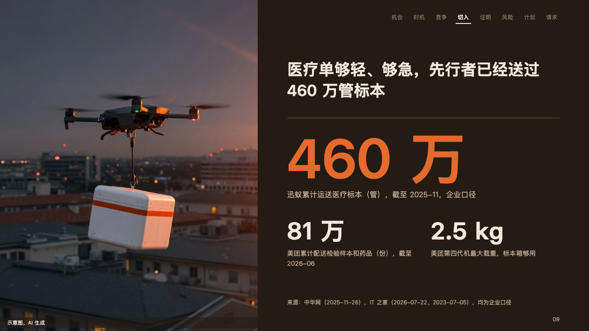

# pitch-photo

ember's photograph page: the photograph down the left, a pitch page of its own in the column beside it.

Code: [`src/layouts/content-pitch-photo.tsx`](../../../src/layouts/content-pitch-photo.tsx). Used by ember for photo pages.

## ember, low-altitude delivery pitch sample, 2026-10

Settled on the medical page (p09). The round's decisions are in [rounds/2026-10-06-ember](../../rounds/2026-10-06-ember/README.md). Its body is [compositions/spotlight](../../compositions/spotlight/).

| board (p09) | engine |
| :-: | :-: |
|  |  |

**What it looks like.** The page's first `image` fills the left 560px from edge to edge, its caption at 11px in the ivory on a strip of the stage at 60% along its foot. The column from x624 to x1216 is a pitch page of its own: the running order at the top right with the page's beat lit, the claim bold at 34/46 ending at y220, a hairline at y256, and from y280 the body: the `spotlight` composition when the rest is one figure lit and others beside it, or the component renderer. The source at the foot of the column, and the deck's label in the folio after the office.

**Why.** A pitch needs one page where the room sees the thing being carried. The photograph takes half the page and the figure beside it says it has been done before.

**What it gave up.**

- A page with no image is set as an ordinary pitch sheet. A column the rest does not fit steps aside.
- The deck's label moves from the top left, which the photograph covers, into the folio at the foot of the column. The board printed none on this page.
- The claim breaks at its comma when it needs two lines (「医疗单够轻、够急，」 over 「先行者已经送过 460 万管标本」).
