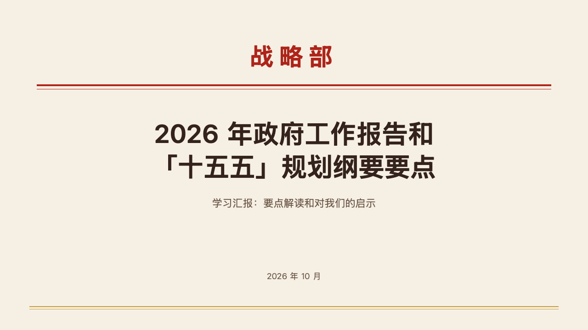
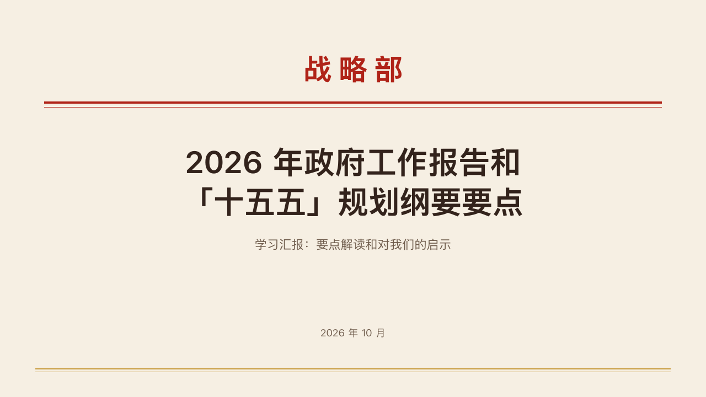

# red-head-cover

The letterhead cover: the issuing body large and red over a thick and a thin red rule, the title centred under them.

Code: [`src/layouts/cover-red-head-cover.tsx`](../../../src/layouts/cover-red-head-cover.tsx). Used by vermilion.

## vermilion, government work report sample, 2026-10

The round's decisions are in [rounds/2026-10-04-vermilion](../../rounds/2026-10-04-vermilion/README.md).

| board (p01) | engine |
| :-: | :-: |
|  |  |

**What it looks like.** `meta.organization` centred in the primary colour, bold, 52px, its Chinese characters 12px apart, on a 64px line from y92. A 4px and a 1px rule in the primary colour from x80 to x1200 at y184 and y194. The `heading` centred in the ink at 56/72 across the full 1120px, evened over two lines when it needs two, its last line on a box ending at y400. The `subheading` at 22/30 from y428 and the date with the authors at 18/26 from y590, both in the quiet ink. The gold rule along the foot is the theme's motif.

**Why.** A red letterhead is how an official document announces who issued it. The body's name carries the page, and the title reads as the document's subject under it.

**What it gave up.**

- The spacing is drawn as `<tspan dx>` steps, which the export writes as character spacing, so only Chinese characters are spaced. A Latin name ("Strategy Department") prints unspaced and centred.
- No issuing body, no letterhead line: the face never invents one.
