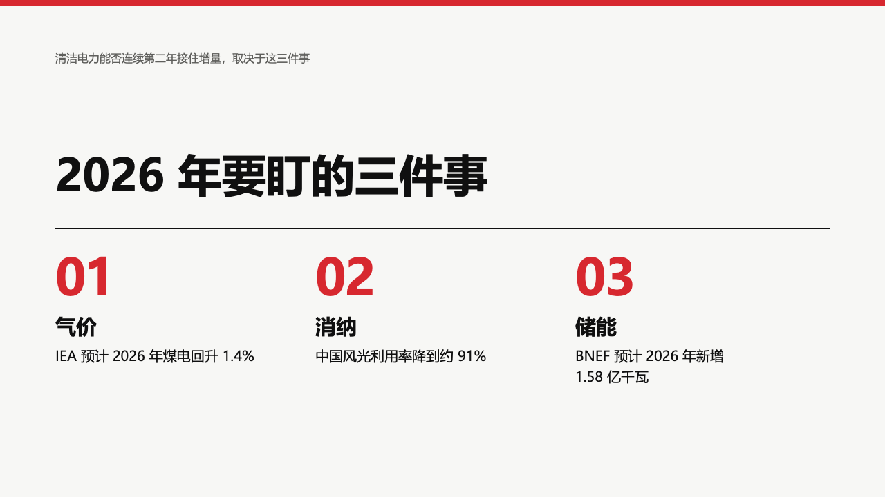
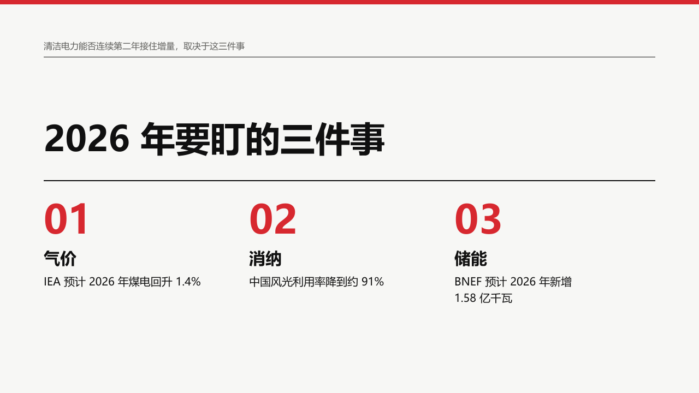

# resolution-ending

An institutional report's closing page: what the page settles in a small line, the closing title, then up to three numbered columns of a label and what it means.

Code: [`src/layouts/ending-resolution-ending.tsx`](../../../src/layouts/ending-resolution-ending.tsx). Used by swiss.

## swiss, power sample, 2026-10

The round's decisions are in [rounds/2026-10-03-swiss](../../rounds/2026-10-03-swiss/README.md).

| board (p14) | engine |
| :-: | :-: |
|  |  |

**What it looks like.** The subheading in one 16px muted line at y72 over a 1px black rule at y104. The title at 64/76 bold across 1120px, set on its last line (box ending at y290). A 2px black rule at y330. Up to three columns 376px apart from y360: the number `01` at 72px bold in the theme's emphasis ink, the label at 30/40 bold, the gloss at 20/30 in up to three lines of 320px. Items come from the first `bullets`: an item written `label：gloss` (or `label: gloss`) is split at the colon, and an item with no colon is set whole as the label.

**Why.** A report closes on the few things to watch, each named in a word and explained in a line.

**What it gave up.**

- The colon becomes the break between label and gloss and is not printed. The label's last line declares it (`data-gloss-break`), so the content audit reads it back where it stood.
- No letter spacing in either language: the old English kicker was tracked 8px, which pulled lowercase letters apart.
- No thanks, no sign-off and no invented resolution number.
