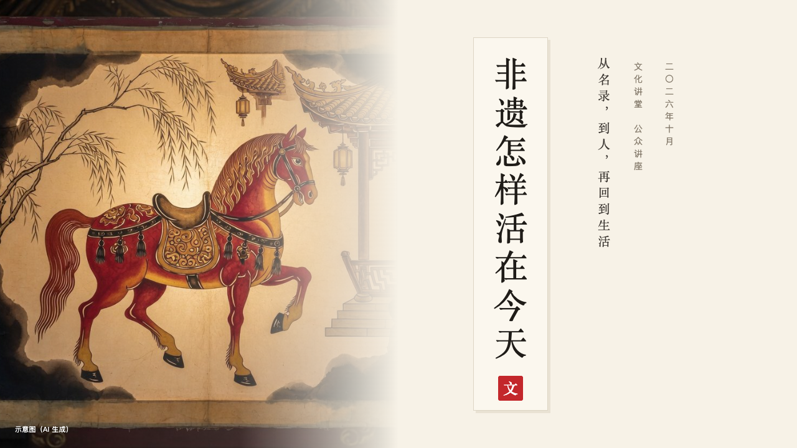
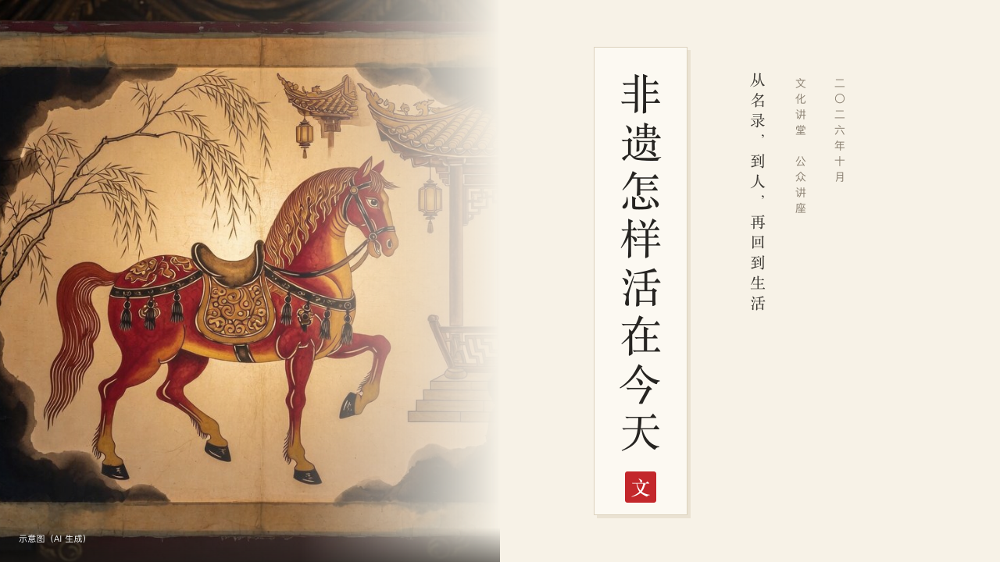

# scroll-cover

ink's cover: a title slip hung beside a photograph.

Code: [`src/layouts/cover-scroll-cover.tsx`](../../../src/layouts/cover-scroll-cover.tsx). Used by ink.

## ink, intangible heritage public lecture sample, 2026-10

Settled on p01. The round's decisions are in [2026-10-07-ink](../../rounds/2026-10-07-ink/README.md).

| board (p01) | engine |
| :-: | :-: |
|  |  |

**What it looks like.** The page's `background` photograph runs the height of the page down the left 640px, washed into the paper from left to right until the right edge is all paper. At the right a title slip hangs: a strip of the whiter paper at x760, 120px wide and 600px tall, with a faint shadow 4px to its lower right. The title stands upright in it, 54px in the heading face tracked 8px, in two columns at 40px when one will not hold it, and at the slip's foot a 40px cinnabar seal whose character is the page's `stamp` (or the hall's first character when the page names none). Beside the slip three upright columns of small type: the subtitle (`subheading`, 20px in the heading face), the hall with the page's `kicker` (「文化讲堂　公众讲座」, 14px in the taupe), and the footer's `label` (「二〇二六年十月」, the date as the author writes it). At the bottom left the page's `footnote` in white over a dark wash at the photograph's foot.

**Why.** A hanging scroll is known by its title slip, and the seal says who hung it.

**What it gave up.**

- A Latin title never stands letter by letter: the slip widens into a strip with the title and the subtitle set across it, and the two small columns are turned a quarter to read from the top.
- No motif and no footer marks. The shared footer prints on content pages only.
