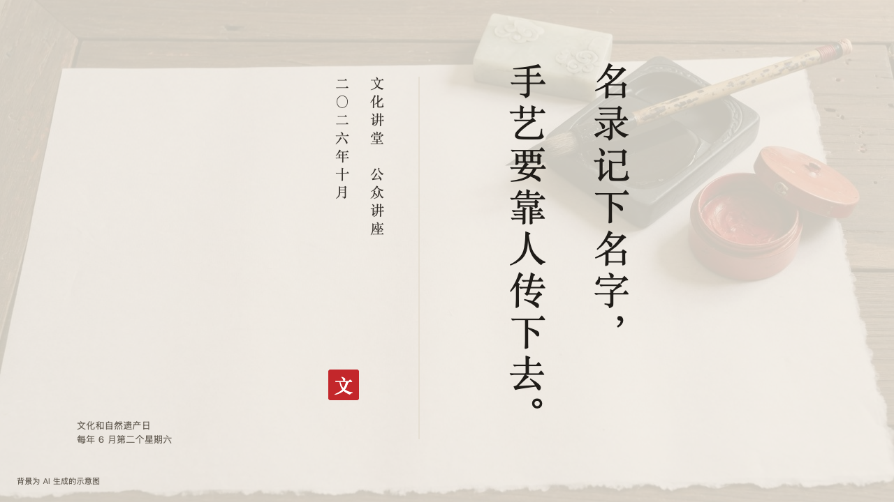
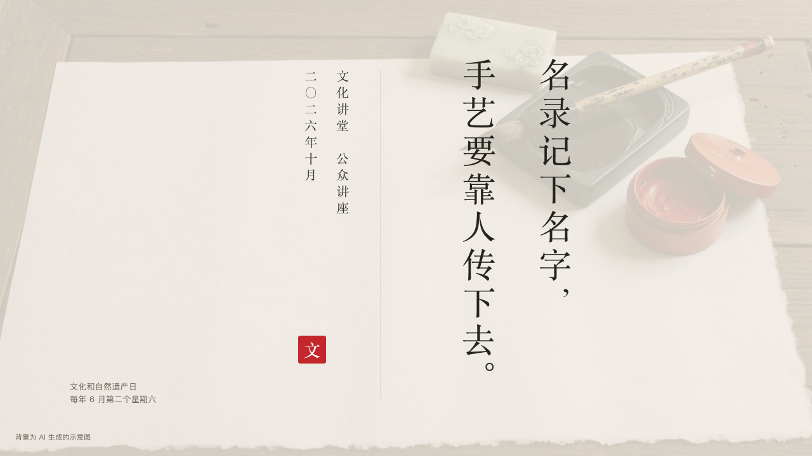

# scroll-ending

ink's close: the scroll signed off.

Code: [`src/layouts/ending-scroll-ending.tsx`](../../../src/layouts/ending-scroll-ending.tsx). Used by ink.

## ink, intangible heritage public lecture sample, 2026-10

Settled on p18. The round's decisions are in [2026-10-07-ink](../../rounds/2026-10-07-ink/README.md).

| board (p18) | engine |
| :-: | :-: |
|  |  |

**What it looks like.** The page's `background` photograph full bleed under a veil of the paper at 82%. In the right half the closing words (`heading`) stand upright, 54px in the heading face tracked 6px, a clause a column: a new column at each comma and full stop the author wrote, and a break at the column's length only when a clause will not fit, the punctuation in vertical form. Left of the words a hairline down the page at x600, and left of it the signature in two upright columns at 20px in the heading face: the hall with the page's `kicker` (「文化讲堂　公众讲座」) and the footer's `label` (「二〇二六年十月」). Under the signature a 44px cinnabar seal from the page's `stamp`. At the bottom left the page's `subheading` as the author breaks it (「文化和自然遗产日」, 「每年 6 月第二个星期六」), and in the corner the `footnote`.

**Why.** A scroll ends with its inscription, its signature and its seal.

**What it gave up.**

- In a Latin deck the closing words are set across the right half a clause a line, and the signature's two columns are turned a quarter to read from the top.
- No motif and no footer marks.
