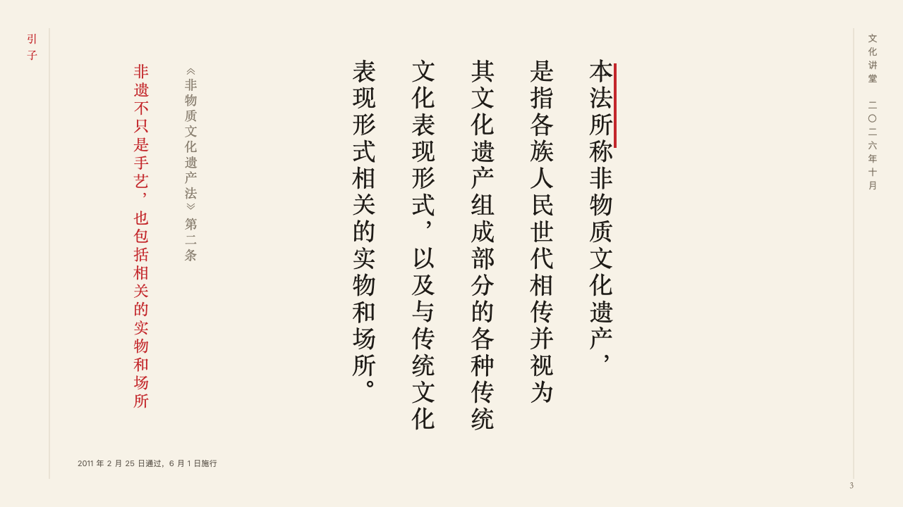
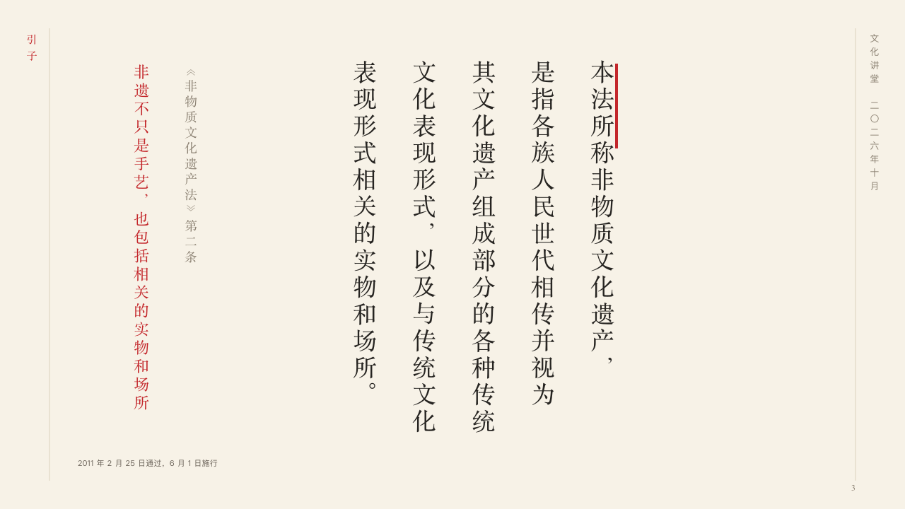

# scroll-quote

ink's quotation page: a passage set upright the way it was written, and what the speaker draws from it.

Code: [`src/layouts/content-scroll-quote.tsx`](../../../src/layouts/content-scroll-quote.tsx), the passage drawn by the [`statute`](../../compositions/statute/README.md) composition. Used by ink for quote.

## ink, intangible heritage public lecture sample, 2026-10

Settled on p03. The round's decisions are in [2026-10-07-ink](../../rounds/2026-10-07-ink/README.md).

| board (p03) | engine |
| :-: | :-: |
|  |  |

**What it looks like.** The passage the page quotes (one `blockquote`) is set by `statute`: in Chinese upright in columns of fourteen characters read from the right at 34px in the heading face, a short cinnabar bar at its head, its punctuation in vertical form, and where it comes from in a column of its own beside it in the taupe. The page's claim is what the speaker draws from it, in cinnabar in the heading face at the far left, upright down a column. The page's source stands at the foot. The volume (the page's `kicker`) is down the left margin and the rest of the frame is the motif's. In a Latin deck the passage is set across the band and the claim across a narrow column at the left.

**Why.** A definition in law is the page. The speaker's reading of it is one line, in the one cinnabar the page spends.

**What it gave up.**

- A page it cannot set as a passage gets the claim over the page and its body under it, and steps aside when that band cannot hold it.
- The claim stands upright only in Chinese.
