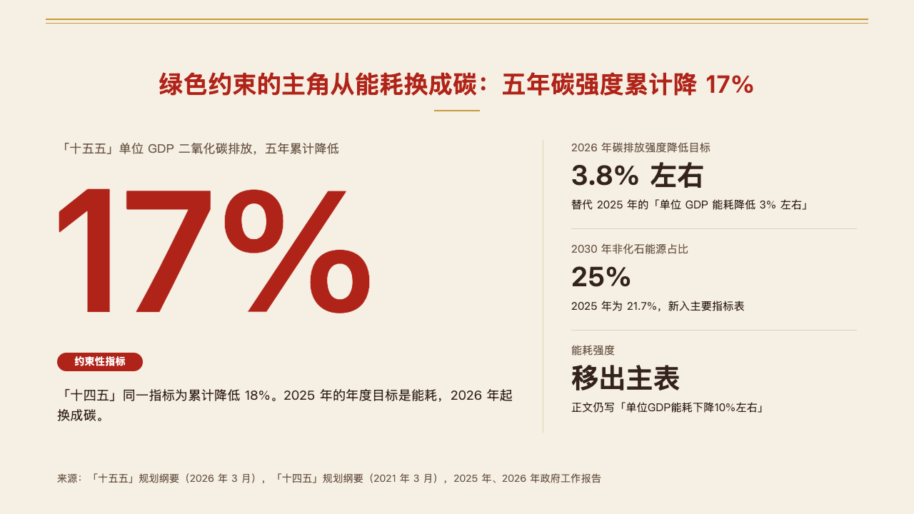
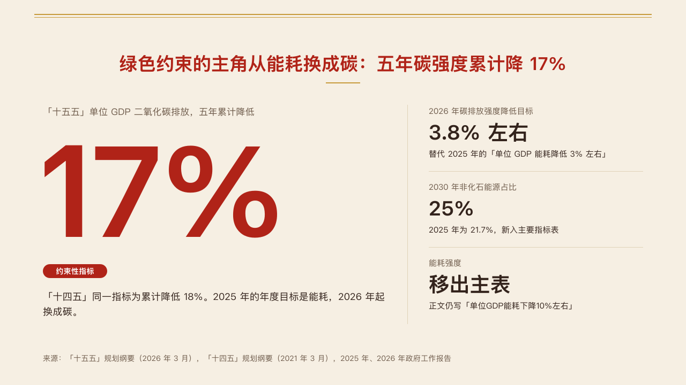

# seal-figure

vermilion's single-figure page: the claim as on every content page, the one figure the page is about at 240px in red on the left, and up to three figures it rests on beside it.

Code: [`src/layouts/content-seal-figure.tsx`](../../../src/layouts/content-seal-figure.tsx), with the frame in [`src/layouts/seal-shared.tsx`](../../../src/layouts/seal-shared.tsx). Used by vermilion.

## vermilion, government work report sample, 2026-10

The round's decisions are in [rounds/2026-10-04-vermilion](../../rounds/2026-10-04-vermilion/README.md).

| board (p08) | engine |
| :-: | :-: |
|  |  |

**What it looks like.** One `kpi_cards` of one to four items. The first is the lead: its label at 17px in the quiet ink, the figure with its unit bold in the primary colour at 240px, set 8px tight, its tag filled in the mark under it, and its note at 18/28. Past a hairline at x760, each other item stands 142px apart: its label at 15px, its figure bold at 38px (in the mark when the author wrote `**…**`), and its note at 15px.

**Why.** A policy page often turns on one number. Set large, it is what the room repeats; the figures beside it are what the number is read against.

**What it gave up.**

- A figure too wide for its 640px column steps down to 200, 160 or 128px.
- No delta, icon or source on a figure, and no tag on a supporting one. A page of any other shape, or one with a subheading, goes to the step-aside sheet, and is declined when that cannot hold it either.
