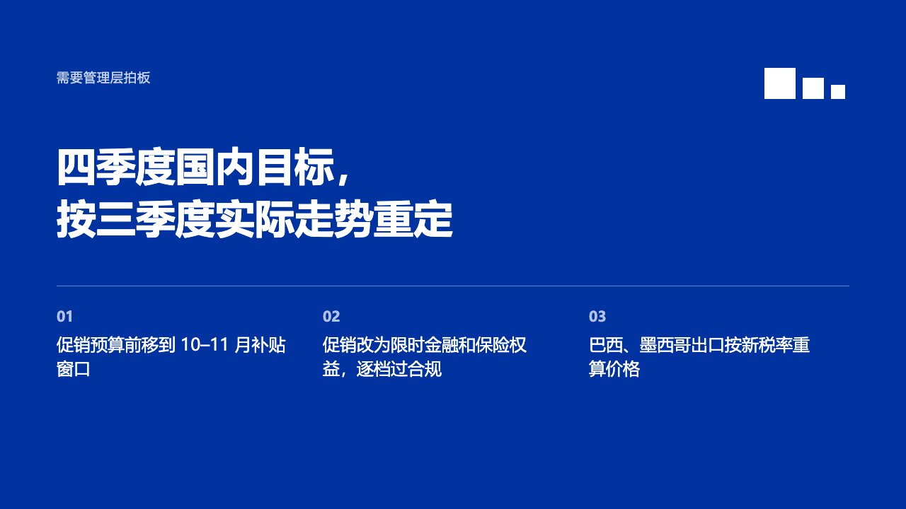

# signoff-ending

The closing page painted full in the theme's primary: what needs deciding, a thin rule, and the next steps as numbered columns.

Code: [`src/layouts/ending-signoff-ending.tsx`](../../../src/layouts/ending-signoff-ending.tsx), with the field's type in [`src/layouts/field-type.tsx`](../../../src/layouts/field-type.tsx).

## bulletin, NEV sample, 2026-10

The round's decisions are in [rounds/2026-10-03-bulletin](../../rounds/2026-10-03-bulletin/README.md).

| board (p13) | engine |
| :-: | :-: |
|  |  |

**What it looks like.** IKB full page with the enlarged white steps. An 18px line at y96 (`subheading`, 「需要管理层拍板」) in white at 78%. The title bold at 56/74 in white from y196, at most two lines in 1000px. A 40% white rule at y404. Under it, the first bullets' items as equal columns: a 20px bold number in white at 70% and the item at 24/34, three lines at most, two to four items.

**Why.** A review ends on the decision and what happens next, not on thanks. The rule keeps a two-line title, English especially, clear of the steps under it.

**What it gave up.**

- No colophon: the organization is on the cover.
- A marked run in the title is underlined in white instead of recoloured, as on the cover. The old face dropped the marks and with them the run.
