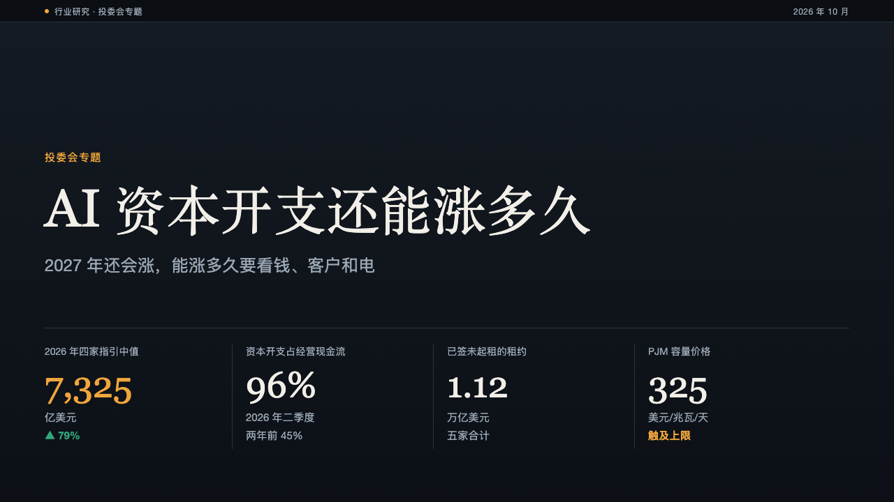
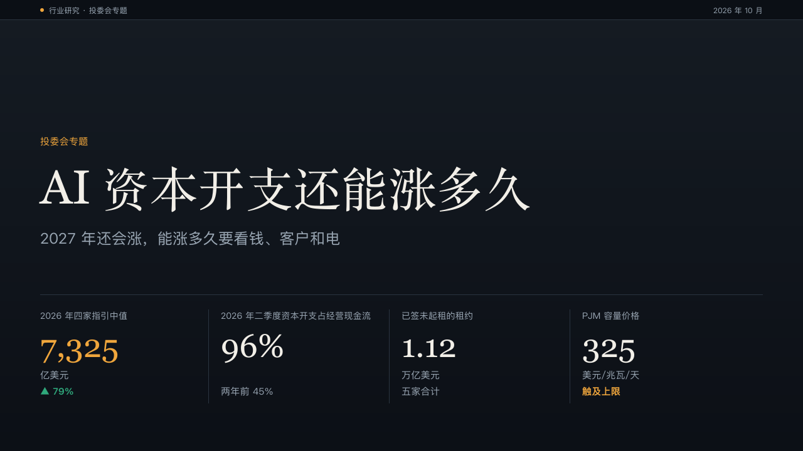

# stat-cover

ledger's cover: a small amber label, the question in a serif, the subtitle, and a ticker of the figures the deck is about under a hairline.

Code: [`src/layouts/cover-stat-cover.tsx`](../../../src/layouts/cover-stat-cover.tsx), with the ticker in [`src/layouts/compositions/ticker.tsx`](../../../src/layouts/compositions/ticker.tsx). Used by ledger.

## ledger, AI capex sample, 2026-10

The round's decisions are in [rounds/2026-10-04-ledger](../../rounds/2026-10-04-ledger/README.md).

| board (p01) | engine |
| :-: | :-: |
|  |  |

**What it looks like.** The page's `kicker` at 15px in amber from y214 ("投委会专题"). The title in the heading face at regular weight, 76/96 from y250, on one line when it fits at 56px or more, otherwise on two. The subtitle 24/32 muted, 18px under it. A 1px border hairline at y470, and under it the first `kpi_cards` as a ticker: two to four cells on a 288px pitch, each a 14px label, the figure at 52px in the heading face, the unit at 15px and a last line, with hairlines between the cells. A figure written `**…**` is amber. A `delta` makes the last line the move, bold in the direction's colour after an arrow ("▲ 79%"). A note written `**…**` whole is bold amber ("触及上限").

**Why.** An investment committee wants the numbers before the argument. The cover already shows the four figures the deck is about, the way a market screen opens on its quotes.

**What it gave up.**

- The old stat-cover set the heading itself as a huge figure with a sentence under it, and the motif drew a wavy line through the cover. Both went: the board's title is a question and its figures stand in the ticker.
- No kicker, no label: the cover prints none rather than inventing one. No `kpi_cards`, no ticker and no hairline.
- A cell keeps one line each for its label, unit and last line. A ticker that does not fit declares the drop rather than cutting words.
