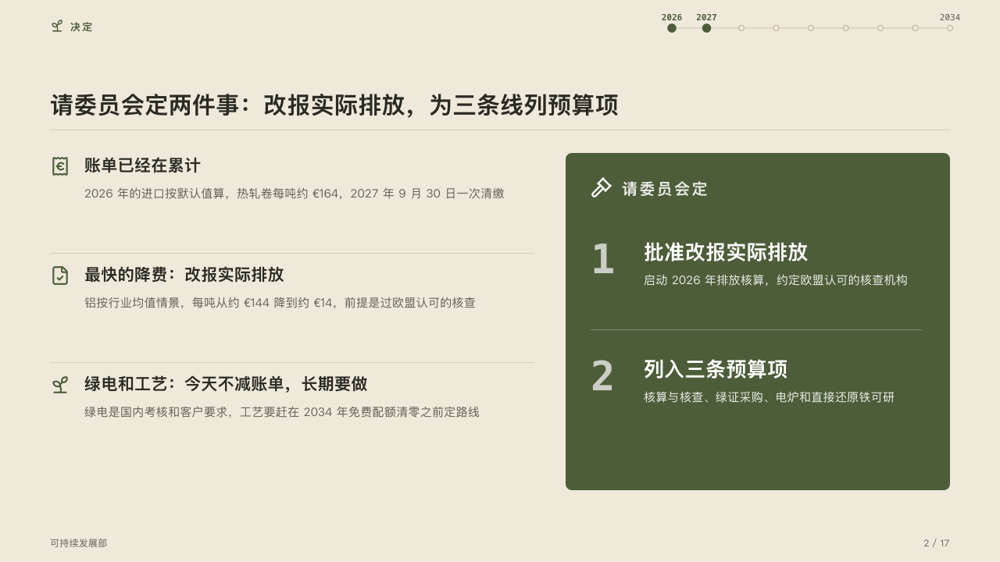

# almanac-motif

almanac's running head and folio: a sprout at the top left of every content page, and on content pages of a deck that asks for a footer the office at the left of the foot and 「N / M」 at the right.

Code: [`src/motifs/motif-almanac-motif.tsx`](../../../src/motifs/motif-almanac-motif.tsx). The motif paints the footer row itself (`"row"` in [`footer-roles.ts`](../../../src/motifs/footer-roles.ts)).

## almanac, CBAM sample, 2026-10

Every content page of the board carries it. The round's decisions are in [rounds/2026-10-05-almanac](../../rounds/2026-10-05-almanac/README.md).

| board (p02) | engine |
| :-: | :-: |
|  |  |

**What it looks like.** An 18px lucide sprout in the mark at x64, y24, the section's label beside it being the face's. At the foot, from y686, the office (`meta.organization`, then the footer's `label` and `notice`) in 12px muted type at x64, and 「N / M」 at the right, N being PowerPoint's slide-number field and M the deck's page count.

**Why.** A small growing thing at the head of every page is the yearbook's one ornament, and the folio says how far into the run the reader is.

**What it gave up.**

- The three contour lines at the top left are retired: the contours now belong to the cover's left column.
- Nothing on the cover and the ending, whose faces draw their own sprout or contours, and nothing on the chapter's full olive page, where an olive sprout would vanish.
- The folio prints 「9 / 17」, as the board did, because the slide-number field cannot pad with a zero.
