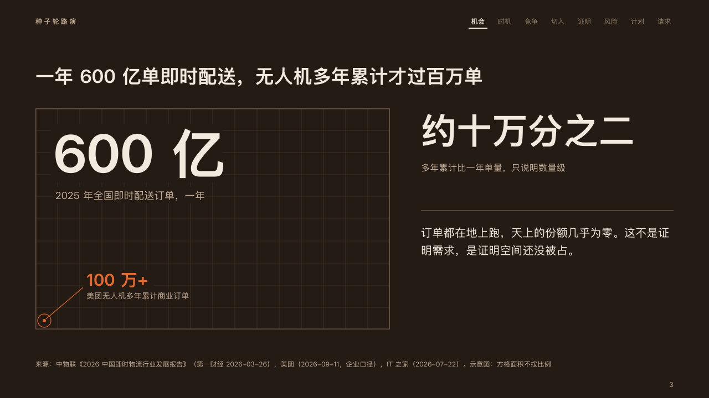

# ember-motif

ember's label and folio.

Code: [`src/motifs/motif-ember-motif.tsx`](../../../src/motifs/motif-ember-motif.tsx). The motif paints the footer row itself (`"row"` in [`footer-roles.ts`](../../../src/motifs/footer-roles.ts)).

## ember, low-altitude delivery pitch sample, 2026-10

Every content page of the board carries it. The round's decisions are in [rounds/2026-10-06-ember](../../rounds/2026-10-06-ember/README.md).

| board (p03) | engine |
| :-: | :-: |
|  |  |

**What it looks like.** On content pages of a deck with a footer: the footer's `label` at the top left, x64 on the running order's line, 12px bold in the warm grey, its characters 3px apart (「种子轮路演」, "Seed round"). At the foot, from y686, the page number at the right (x1216), 12px in the warm grey, after any draft or confidentiality mark, and the office (`meta.organization`) and the footer's `notice` at the left. The number is PowerPoint's slide-number field. When the face keeps a photograph at the left (the photograph page), the left of the folio moves past it and the label joins it there, after the office.

**Why.** The label says which occasion this is and the number where the room is. Neither competes with the running order, which says which beat.

**What it gave up.**

- The rising sparks of the old motif stay retired, and the corner wedge belongs to the cover and the close.
- The number is 「3」, not the board's 「03」: a slide-number field cannot be padded.
- Nothing on the cover, the acts and the close, whose faces draw themselves.
