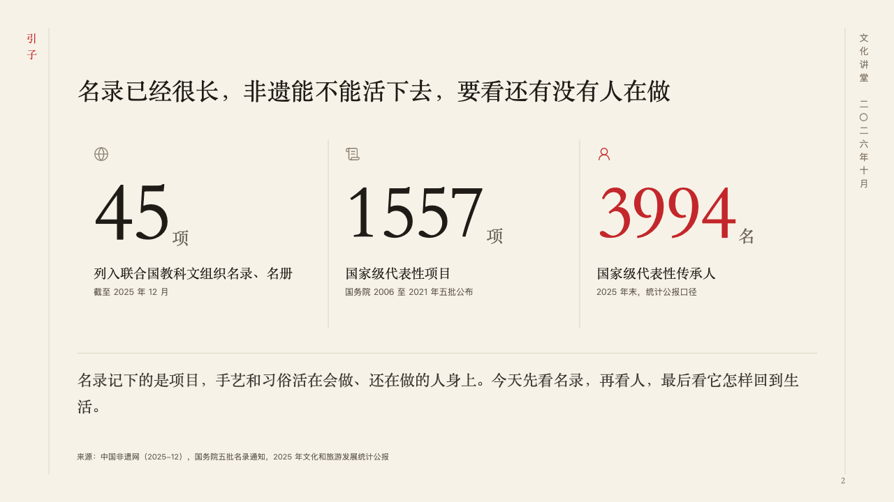

# ink-motif

ink's scroll edges, the hall and the date down the right margin, and the folio.

Code: [`src/motifs/motif-ink-motif.tsx`](../../../src/motifs/motif-ink-motif.tsx). The motif paints the footer row itself (`"row"` in [`footer-roles.ts`](../../../src/motifs/footer-roles.ts)).

## ink, intangible heritage public lecture sample, 2026-10

Every content page of the board carries it. Redrawn this round (v2): it used to draw a half mountain at the cover's lower left, a column of the organization and a date converted to Chinese numerals down the content pages' right edge with a small seal at its foot, and a half mountain on the close. The round's decisions are in [2026-10-07-ink](../../rounds/2026-10-07-ink/README.md).

| board (p02) | engine |
| :-: | :-: |
|  |  |

**What it looks like.** On every content page two hairlines down the page at x70 and x1210 from y40 to y680, the scroll's edges. On content pages of a deck with a footer: down the right margin from y48 the hall and the date stand upright, 13px in the taupe tracked 6px (the deck's `organization` and the footer's `label`, as the author writes them), turned a quarter to read from the top in a Latin deck. The folio, the page number at 12px in the heading face in the taupe, right-aligned on the right edge at y680. The footer's notice at the bottom left, and the draft and confidentiality marks before the folio, 11px in the grey.

**Why.** A hanging scroll carries its inscription in the margin, and its two edges are what make a page read as part of it.

**What it gave up.**

- The number is PowerPoint's slide-number field.
- A hall and date too long for the margin's 600px are declared dropped.
- Nothing on the cover, the chapter pages and the close, which draw their own.
- The volume down the left margin is the face's (the page's `kicker`), not the motif's.
