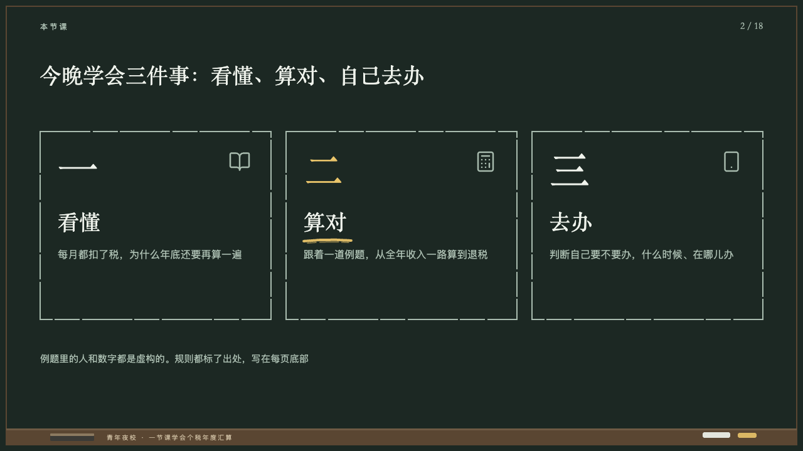

# lecture-motif

lecture's blackboard: a wooden frame round every page, the chalk ledge along its foot with its chalk and its eraser, the course written on the ledge and the period's count at the top right.

Code: [`src/motifs/motif-lecture-motif.tsx`](../../../src/motifs/motif-lecture-motif.tsx), its wood from `chalkboardLedge` in [`src/layouts/compositions/chalkboard.tsx`](../../../src/layouts/compositions/chalkboard.tsx). Used by lecture.

## lecture, annual tax reconciliation evening class sample, 2026-10

Settled on every page. The pair below is p02. The round's decisions are in [2026-10-08-lecture](../../rounds/2026-10-08-lecture/README.md).

| board (p02) | engine |
| :-: | :-: |
|  |  |

**What it looks like.** A 2px frame of dark wood from (10, 10) 1260 by 700. A ledge of the same wood from y684 26px deep, its top 3px a step lighter, holding a piece of white chalk 44 by 9 at x1120, a piece of yellow chalk 30 by 8 at x1176 and an eraser 70 by 12 at x80 with its felt 4px on top. The deck's organization, `label`, notice and draft and confidentiality marks joined by a middle dot at 10px tracked 2px in a pale wood on the ledge from x170. The count at 15px in the serif in the chalk grey ending on x1216 from y30: the page number, PowerPoint's slide-number field, then 「/ 18」. The words and the count are drawn only when the deck asks for them, the board always. The wood is the theme's yellow chalk turned toward red, two fifths as saturated and darkened to a stain (#5A4632 from #E9C46A), the lip, the ledge's words and the eraser the same hue.

**Why.** The page is a blackboard: at thumbnail size it has to read as one before a word is read.

**What it gave up.**

- The 2026-08 motif was a 1px seam inset 26px, which read as a dark frame rather than a board. The frame now stands 10px in and the ledge is the motif's.
- The board frames the cover, the chapter, the close over its photograph and every content page alike, as a structural piece.
- The count reads 「3 / 18」 as the board printed it. A cover, a chapter or a close leaves the confidentiality mark to the cover's own mark rather than writing it on the ledge.
