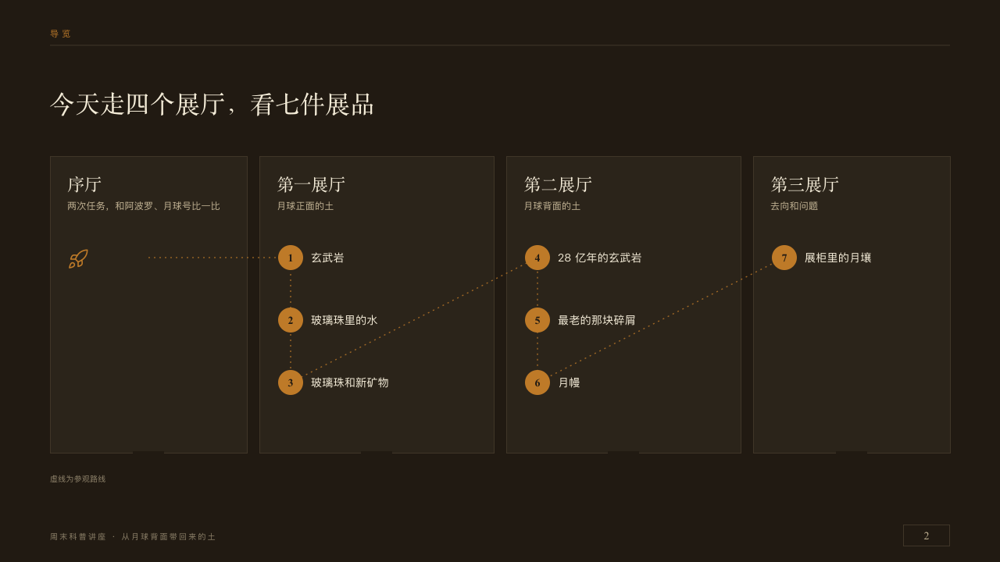

# museum-motif

museum's gallery wall on every content page: the hall at the top left over a seam, the talk's label at the bottom left, the page number on a door plate at the bottom right.

Code: [`src/motifs/motif-museum-motif.tsx`](../../../src/motifs/motif-museum-motif.tsx), drawing `PlacardHall` and `PlacardFoot` from [`src/layouts/placard-shared.tsx`](../../../src/layouts/placard-shared.tsx). Used by museum.

## museum, Moon soil science talk sample, 2026-10

Settled on every content page. The pair below is p02. The round's decisions are in [2026-10-08-museum](../../rounds/2026-10-08-museum/README.md).

| board (p02) | engine |
| :-: | :-: |
|  |  |

**What it looks like.** From y34 the page's `kicker` at 11px in copper tracked 4px, a seam across the page under it on y58. On a deck that asks for footer marks, the deck's `organization` and the footer's `label` at the bottom left from y678, 10px in the dim tracked 2px, the notice, draft and confidentiality marks after them, and the page number at 14px in the serif in old paper inside a 60 by 28 frame of the seam's colour at x1156, y672, PowerPoint's slide-number field. On a deck with no footer the hall and the seam stay and the label and the plate go. It paints the footer row itself (`footer-roles.ts`). One structural piece, words, one seam and one frame.

**Why.** Every content page stands in a hall of the same gallery, and its number is the plate on the hall's door.

**What it gave up.**

- The folio reads 「2」, not the board's 「02」: a slide-number field cannot be padded.
- museum took no motif since 2026-08, when its corner pins and tick were struck as decoration. The hall sign carries no decoration, only words, a seam and a frame, as a structural piece.
- The cover, the chapter pages and the close draw their own hall sign and keep the motif off. The chapter face draws the door plate itself.
