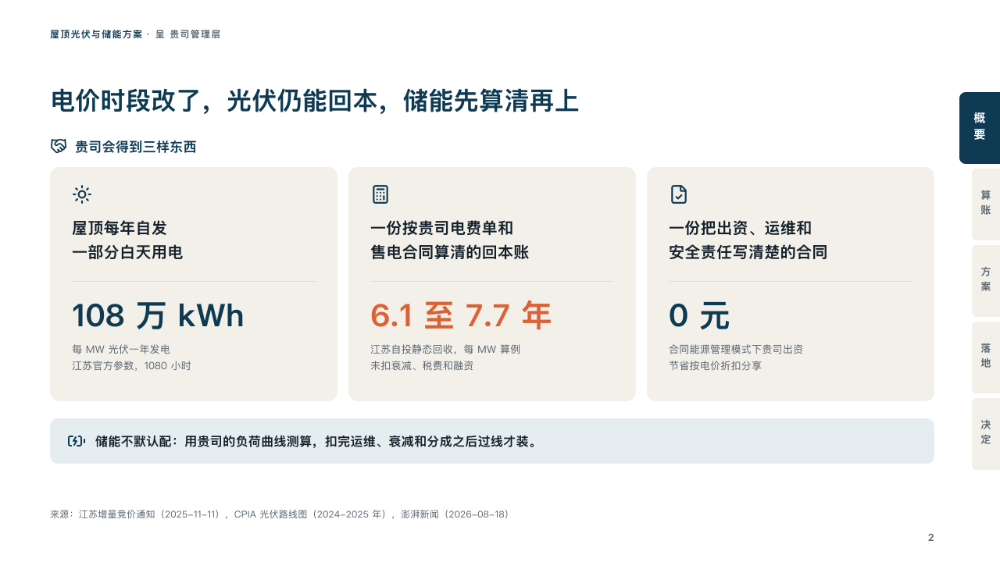

# proposal-motif

proposal's deck label and folio.

Code: [`src/motifs/motif-proposal-motif.tsx`](../../../src/motifs/motif-proposal-motif.tsx). The motif paints the footer row itself (`"row"` in [`footer-roles.ts`](../../../src/motifs/footer-roles.ts)).

## proposal, rooftop solar and storage proposal sample, 2026-10

Every content page of the board carries it. The round's decisions are in [rounds/2026-10-06-proposal](../../rounds/2026-10-06-proposal/README.md).

| board (p02) | engine |
| :-: | :-: |
|  |  |

**What it looks like.** On content pages of a deck with a footer: at the top left on y34 the footer's label at 12/18 bold, its characters 1px apart, the part before the first " · " in petrol and the rest in the grey (「屋顶光伏与储能方案 · 呈 贵司管理层」). At the bottom right on y678 the page number at 13px bold in the grey, right-aligned at x1196 so the tabs keep the edge, after any draft or confidentiality mark. The office and the footer's notice at the bottom left.

**Why.** The label says whose proposal a page is from wherever it is photocopied. The number keeps a page findable in a meeting.

**What it gave up.**

- The number is 「2」, not the board's 「02」: a slide-number field cannot be padded.
- Nothing on the cover, the section pages and the close, whose faces draw their own frame.
