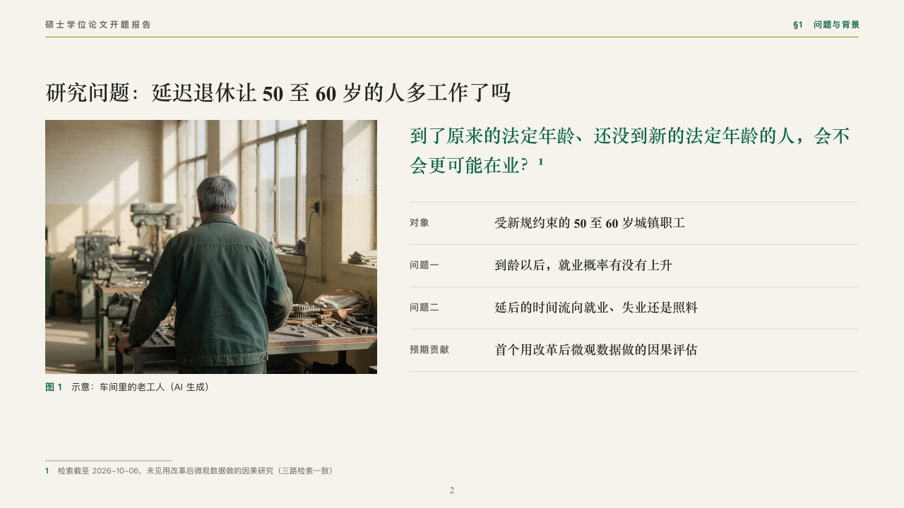

# rail-motif

thesis's running label and folio.

Code: [`src/motifs/motif-rail-motif.tsx`](../../../src/motifs/motif-rail-motif.tsx). The motif paints the footer row itself (`"row"` in [`footer-roles.ts`](../../../src/motifs/footer-roles.ts)).

## thesis, retirement age thesis proposal sample, 2026-10

Every content page of the board carries it. Redrawn this round: it used to draw a gold opening rule on the cover. The round's decisions are in [rounds/2026-10-06-thesis](../../rounds/2026-10-06-thesis/README.md).

| board (p02) | engine |
| :-: | :-: |
|  |  |

**What it looks like.** On content pages of a deck with a footer: at the top left of the running head the footer's label at 12/18 bold in the grey, its characters 3px apart (「硕士学位论文开题报告」). At the foot the page number centred at x640 at 13px in the heading serif in the grey. The office and the footer's notice at the bottom left, the draft and confidentiality marks at the bottom right, 11px.

**Why.** A thesis page carries its running head and a centred folio, as a printed thesis does.

**What it gave up.**

- The number is 「2」, not 「02」: a slide-number field cannot be padded.
- A label too wide for the left half of the head, where the section stands at the right, is declared dropped.
- Nothing on the cover, the section pages and the close, whose faces draw their own label.
