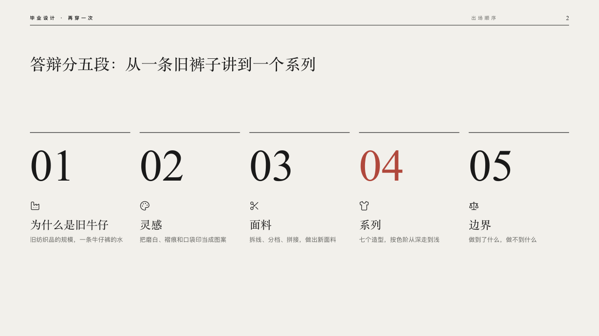

# runway-motif

runway's running order across the top of every content page: the show at the left, the page's section and its number at the right, a black hairline under them.

Code: [`src/motifs/motif-runway-motif.tsx`](../../../src/motifs/motif-runway-motif.tsx), drawing `LineupMasthead` from [`src/layouts/lineup-shared.tsx`](../../../src/layouts/lineup-shared.tsx). Used by runway.

## runway, graduation collection review sample, 2026-10

Settled on every content page. The pair below is p02. The round's decisions are in [2026-10-08-runway](../../rounds/2026-10-08-runway/README.md).

| board (p02) | engine |
| :-: | :-: |
|  |  |

**What it looks like.** From y30, on a deck that asks for footer marks, the deck's `organization` and the footer's `label` at the left (「毕业设计 · 再穿一次」), 10px in bold in the ink tracked 4px, the footer's notice after them. At the right the page's `kicker`, 10px in the stone grey tracked 4px, ending on x1060, the draft and confidentiality marks before it, and the page number at 13px in the serif ending on x1216, PowerPoint's slide-number field. A black hairline across the page under them on y54. A page whose face runs a photograph from the left edge (`data-frame-left` on its drawing, handed to the motif as `frameLeft`) starts the masthead beside it. On a deck with no footer the section and the hairline stay and the label and the number go. It paints the footer row itself (`footer-roles.ts`). One structural piece, words and a rule only.

**Why.** Every content page is a sheet of the same show's running order. The page number stands where the exit number stands on a running order.

**What it gave up.**

- The folio reads 「2」, not the board's 「02」: a slide-number field cannot be padded.
- runway took no motif since 2026-08, a ruling against decoration. The masthead carries no decoration, only words and a hairline, as a structural piece.
- The cover, the chapter pages and the bow draw their own masthead and keep the motif off.
