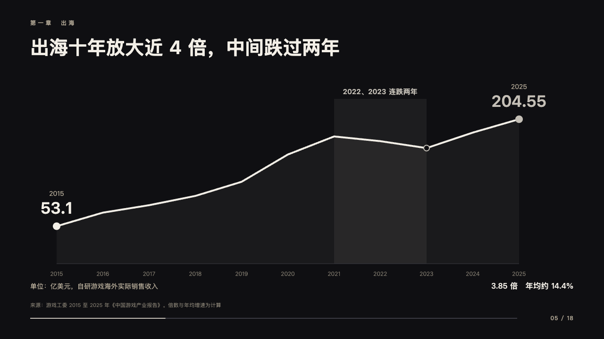
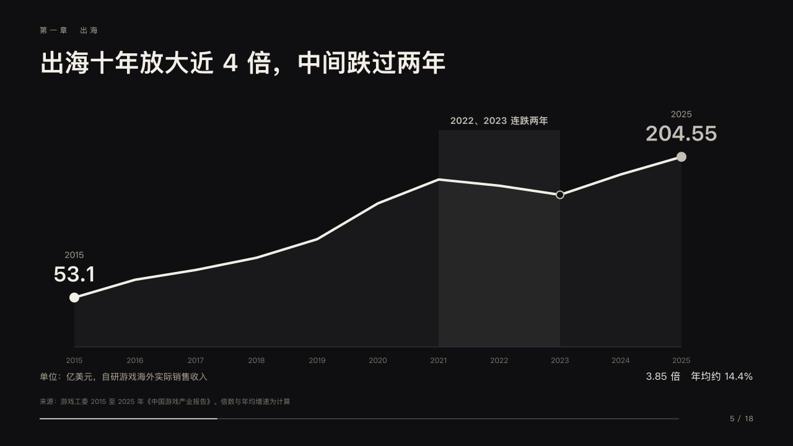

# stage-motif

stage's presenter's clicker along the foot of every content page: the part of the talk given in silver and the count at its end.

Code: [`src/motifs/motif-stage-motif.tsx`](../../../src/motifs/motif-stage-motif.tsx), drawing `KeynoteClicker` from [`src/layouts/keynote-shared.tsx`](../../../src/layouts/keynote-shared.tsx). Used by stage.

## stage, game developers keynote sample, 2026-10

Settled on every content page. The pair below is p05. The round's decisions are in [2026-10-08-stage](../../rounds/2026-10-08-stage/README.md).

| board (p05) | engine |
| :-: | :-: |
|  |  |

**What it looks like.** A 2px track from x64 to x1096 on y676 in the cool grey a few steps up from the black, the part from x64 to this page's place over the deck's length in silver, and at the end the count at 12px in the sand tracked 1px, its last character on x1216: the page number, PowerPoint's slide-number field, then 「/ 18」, the deck's length at export. The count is drawn only when the deck asks for page numbers, the track always. The deck's other footer marks (`organization`, `label`, `notice`, draft and confidentiality) stand at the top right at 12px in the dim tracked 2px. It paints the footer row itself (`footer-roles.ts`). One structural piece, one line and a number.

**Why.** A keynote is a run of moments the room cannot page back through: the clicker tells the room how far the talk has come, the way a presenter's remote does.

**What it gave up.**

- The count reads 「5 / 18」, not the board's 「05 / 18」: a slide-number field cannot be padded. The total is the deck's length at export and does not follow a page added in PowerPoint, and neither does the silver part of the track.
- stage took no motif since 2026-08 (「无框就是身份」). The clicker carries no frame and no decoration, only a line and a count, as a structural piece.
- The cover, the chapter pages and the close draw their own clicker and keep the motif off. Over a photograph the track is the paper white a quarter strong.
