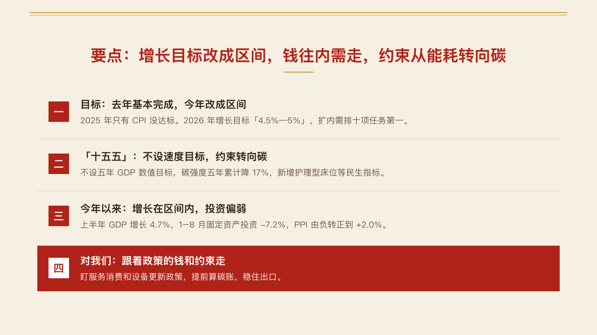

# vermilion-motif

vermilion's gold double rule: a 2px and a 1px rule six pixels apart, from x64 to x1216.

Code: [`src/motifs/motif-vermilion-motif.tsx`](../../../src/motifs/motif-vermilion-motif.tsx). Used by vermilion.

## vermilion, government work report sample, 2026-10

Settled on every page. The round's decisions are in [rounds/2026-10-04-vermilion](../../rounds/2026-10-04-vermilion/README.md).

| board (p02) | engine |
| :-: | :-: |
|  |  |

**What it looks like.** The two rules in the accent (vermilion's gold), the thick one on top. Content pages carry them along the head at y26 and y32, the cover along the foot at y668 and y674, and the ending at both. Each pair is one decor piece of the structure role, so it paints in the foreground. The chapter page draws its own closing rule and the sparse faces draw their own frames, so the motif steps back on both. The photo page's menu turns the motif off (`decor: "silent"`) and its column draws the rule from the photograph's edge.

**Why.** An official document is ruled, not decorated. The gold pair is the one ornament every page shares, and it never carries a word: gold presses the paper at 2.26:1.

**What it gave up.**

- The fan of gold rays and the gold diamond at the foot of earlier versions are gone, as is the line at x48 to x1232.
- No star, emblem or flag: the red and the gold say what kind of page it is on their own.
