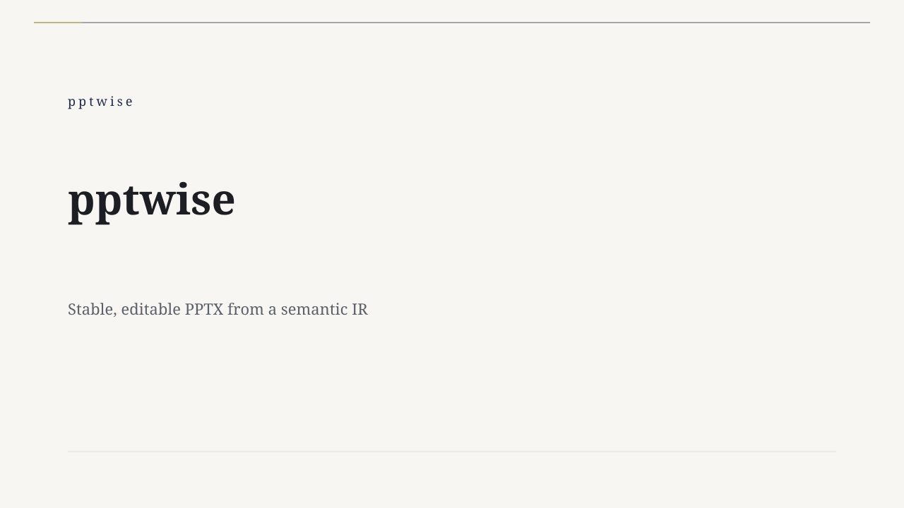
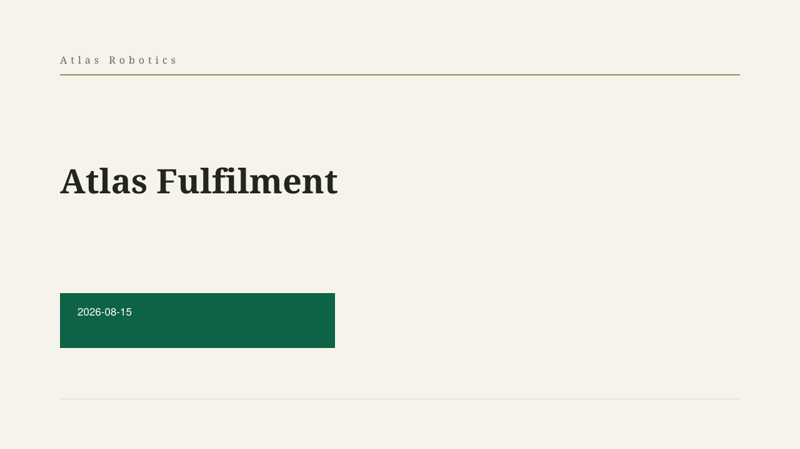
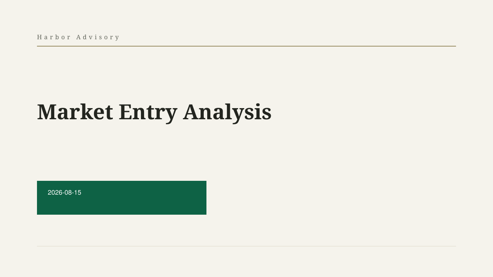
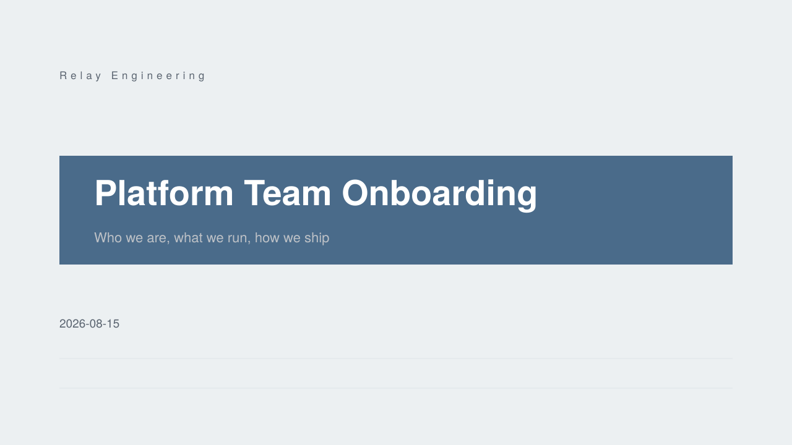
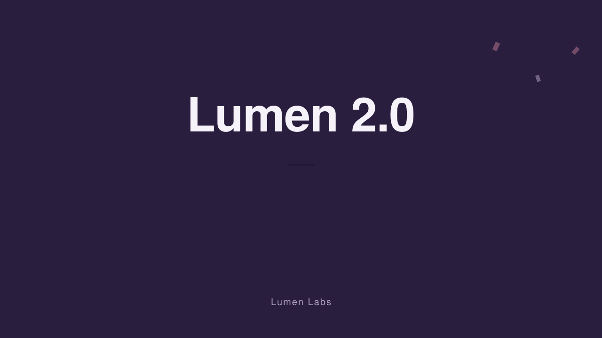

# Examples

Seven ready-to-run decks covering the main slide types, component families,
and themes. Every one validates and audits clean against the current schema
(`pnpm build`, then the commands below).

| Example | What it shows | Preview |
| --- | --- | --- |
| [`basic.json`](basic.json) | The five-slide starter: `cover` / `chapter` / `content` (`bullets`, `kpi_cards`) / `ending`. Theme `consulting`. |  |
| [`product-pitch.json`](product-pitch.json) | A customer pitch (`narrative: "pitch"`): `icon_cards`, `kpi_cards`, `comparison`, and the `quote` arrangement. Theme `tech`. |  |
| [`quarterly-review-zh.json`](quarterly-review-zh.json) | A Chinese business review (`narrative: "weekly-brief"`): `data_table`, a `waterfall` profit bridge, `numbered_cards`, a `warn` callout. Theme `vermilion`. |  |
| [`data-charts.json`](data-charts.json) | Data-heavy pages: grouped `bar`, `line`, and `donut` charts plus a `heatmap`. Theme `insight`. |  |
| [`strategy-analysis.json`](strategy-analysis.json) | Consulting structures: full-body `swot` and `five_forces`, a 2×2 `matrix`, a `verdict_banner` recommendation. Theme `academic`. |  |
| [`team-onboarding.json`](team-onboarding.json) | People and process: `people_cards`, `tag_row`, `steps`, a `cycle` loop, a vertical `timeline`. Theme `classroom`. |  |
| [`launch-deck/`](launch-deck/) | A full deck **project** (`deck.spec.json` + `pages/*.json`): the spec locks page order and headings, page files fill content, `assemble` produces the renderable IR. Theme `campaign`. |  |

Preview images are each deck's first page, produced by `pptpress preview`
(regenerate with the commands below after changing an example).

## Running the examples

Build the CLI once, then run any of the commands below from the repo root:

```bash
pnpm build

# validate an IR against the schema
node dist/cli.js validate examples/basic.json

# render to a .pptx
node dist/cli.js render examples/basic.json -o out/basic.pptx

# render each slide to an SVG for a quick visual self-check
node dist/cli.js preview examples/basic.json -o out/svgs

# check layout quality (contrast, truncation, dropped content)
node dist/cli.js audit examples/basic.json

# same deck, a different built-in theme
node dist/cli.js render examples/basic.json -o out/basic-ink.pptx --theme ink
```

The deck project has one extra step — assemble the spec + pages into an IR
first (this writes `launch-deck/deck.json`, which is git-ignored as a
generated artifact):

```bash
node dist/cli.js spec validate examples/launch-deck/deck.spec.json
node dist/cli.js assemble examples/launch-deck
node dist/cli.js render examples/launch-deck -o out/launch.pptx
```

`pnpm e2e` runs `basic.json` end to end (build → render → structural
assertions on the produced pptx → preview → optional LibreOffice PDF
conversion when `soffice` is installed) and writes its output to
`.e2e-out/` (git-ignored).

## Refreshing the previews

```bash
node dist/cli.js preview examples/<name>.json -o /tmp/preview-<name>
cp /tmp/preview-<name>/001-cover.svg examples/previews/<name>.svg
```
